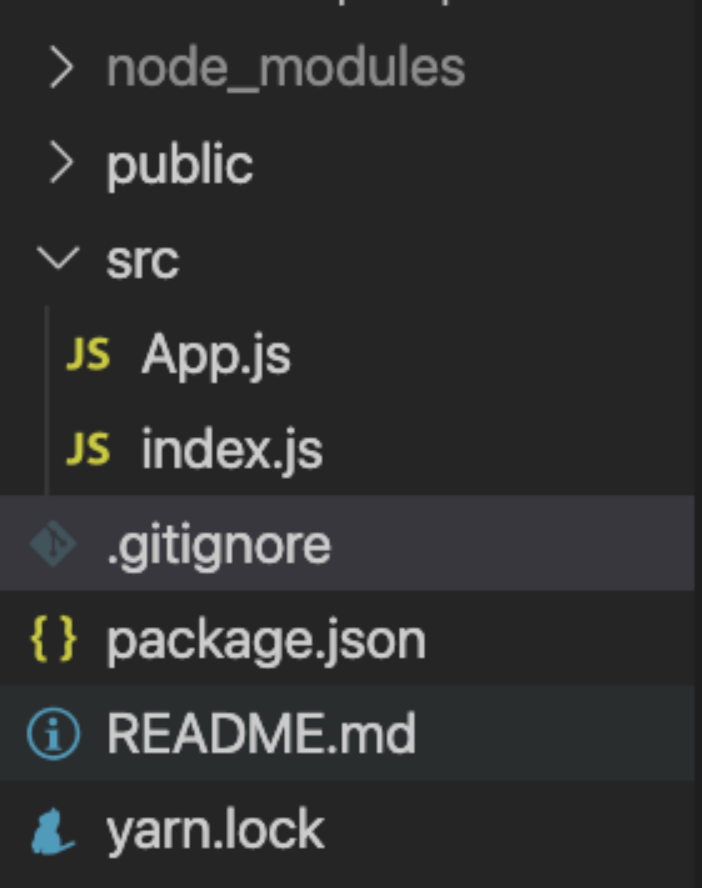
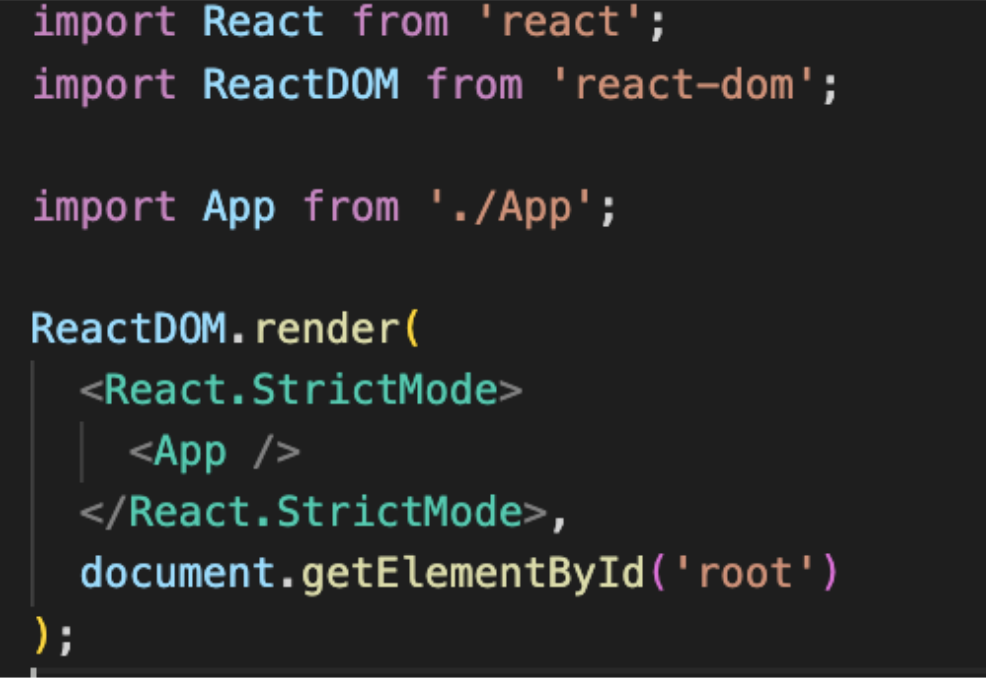
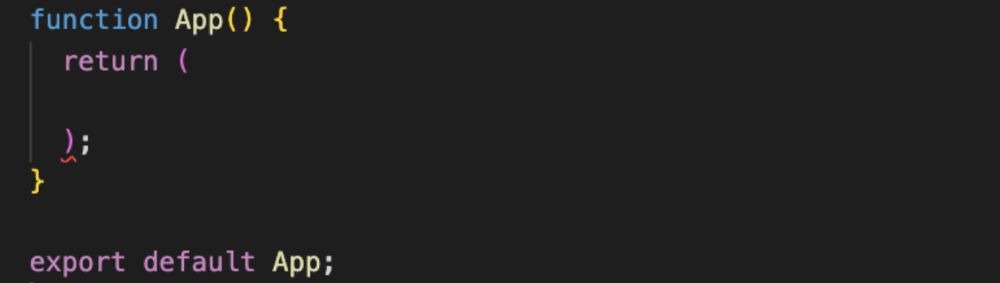
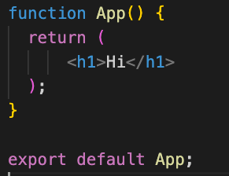
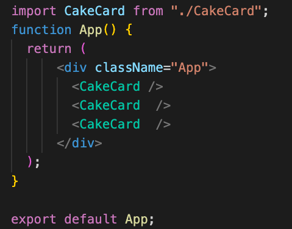
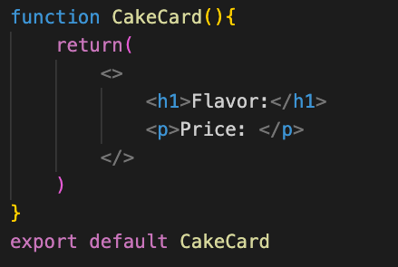
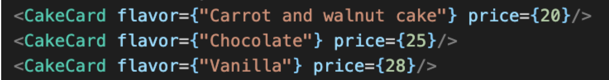
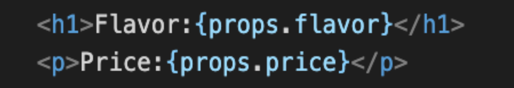

# Breakout Activity

## Deliverables
You will be making an application for Flatirons Baking company! It should display several cakes!   

<ol>
  <li>Create a react app using the create react app tool. After creating it, open your new app in vscode.

  [Create React App](https://reactjs.org/docs/create-a-new-react-app.html)
  </li>
  <details>
   <summary>
    solution 
   </summary>
   <hr/>
   Enter the following in your terminal

   ```
   npx create-react-app flatiron-bakes

   cd flatiron-bakes 

   code .
   ```
   > note: If Vscode doesn't open with `code .`, open it manually through finder and set up your shell command after lecture [Vscode Launching from command line](https://code.visualstudio.com/docs/setup/mac)
   <hr/>
  </details>
<br/>
  <li>
  Delete every file inside the src folder but App.js and index
.js 

  </li>
  <details>
   <summary>
    solution 
   </summary>
   <hr/>
   
   <hr/>
  </details>
<br/>
  <li>
  In index.js remove everything but the imports from React, ReactDom App and the ReactDom.render content.
  </li>
  <details>
   <summary>
    solution 
   </summary>
   <hr/>
   
   <hr/>
  </details>
<br/>

  <li>
  In App.js remove everything but the App component and its export.
  </li>
  <details>
   <summary>
    solution 
   </summary>
   <hr/>
    
   <hr/>
  </details>
<br/>

  <li>
  Start your app and open it in the browser 
  </li>
  <details>
   <summary>
    solution 
   </summary>
   <hr/>
   Enter the following in your terminal.

   `npm start`
   <hr/>
  </details>
<br/>

  <li>
  Inside of App.js create an `h1` tag that will display the name of our bakery. Check your app in your browser to verify your work!
  </li>
  <details>
   <summary>
    solution 
   </summary>
   <hr/>
    
   <hr/>
  </details>
<br/>


  <li>
  Build a new component called CakeCard. It should be in its own file.
  <ul>
    <li>
    Add an `h1`tag for a cake name and a `p` tag for the cake price. Put in default data for now.
    </li>
    <li>
    Export the CakeCard from its file with export default and import it into App.js. Render the CakeCard component 3 times. 
    </li>
  </ul>
  </li>
  <details>
   <summary>
    solution 
   </summary>
   <hr/>
    
    
   <hr/>
  </details>
<br/>
</ol>

### Bonus
<ol>
  <li>
  Pass the CakeCard a props parameter
  </li>
  <details>
   <summary>
    solution 
   </summary>
   <hr/>
    
   <hr/>
  </details>
<br/>
  <li>
  In App.js pass the CakeCards a flavor and price prop. 
    <ul>
        <li>
        If you have them installed use react dev tools to view the props or for the CakeCard component.  Otherwise console.log the props in CakeCard. What do you observe?
        </li>
    </ul>
  </li>
  <details>
   <summary>
    solution 
   </summary>
   <hr/>
   
   <hr/>
  </details>
<br/>
  <li>
  Display the props in the cake card.
  </li>
  <details>
   <summary>
    solution 
   </summary>
   <hr/>
    
   <hr/>
  </details>
<br/>
</ol>


