# Breakout Activity

## Note on feedback: C.A.S.K
Consensual, Actionable, Specific, Kind.   
Feedback is an important part of improving as a developer, but it’s important that we deliver it in a constructive way.

- C - Consensual: ask if you can give someone feedback
- A - Actionable: feedback should be actionable, avoid words like “good” or “bad”
- S - Specific: feedback needs to be specific, avoid generalizations. 
- K- Kind: don’t be a jerk.


## Deliverables
You will be creating dynamic components by importing data into App and passing it to components through props! 

>Note: Review Props Basics and 
Props Destructuring and Default Values if you get stuck

<ol>
  <li>
   
  Review our code from earlier to confirm your understanding of props.
  <ul>
    <li>What are props?</li>
    <li>How are they passed? </li>
    <li>In App, what is that storeName on the Header component? How does that relate to the props.storeName in the actual Header component? </li>
     <li>If you ran this in the browser what would display on the screen in the Header Component?
    </li>
   </ul>
      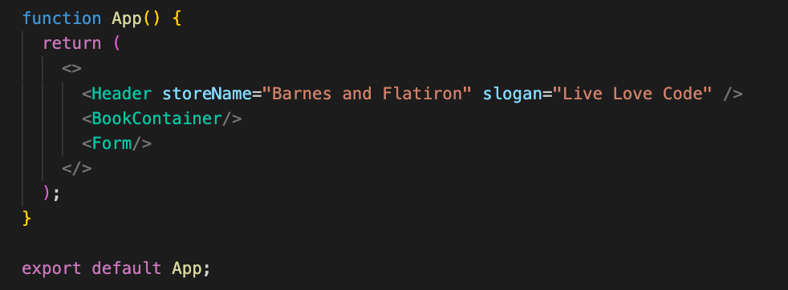
      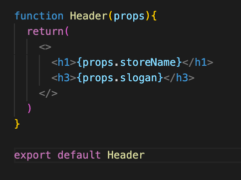
  
<br/>
  <li>
  Start the server and Discuss Components.   
  Run the server with `npm start`.
  Using this wireframe, discuss and create the component hierarchy for this app. Physically draw out the component hierarchy. Use arrows to annotate how you think props are passed if data is imported into App. 
    
  
  </li>

<br/>
  <li>
  Time to hop into code!
  Clear the APP component. Delete the Cake components from the App.
  </li>
  <details>
   <summary>
    solution 
   </summary>
   <hr/>
   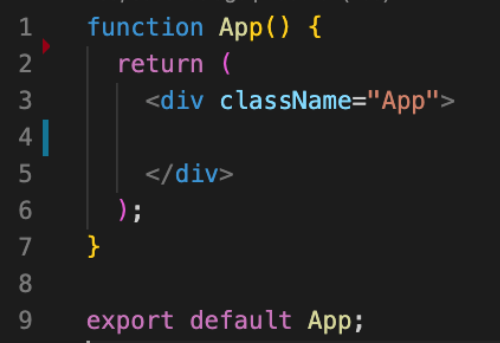
   <hr/>
  </details>
<br/>

  <li>
  Create files for every component from the wireframe above. You should add Header, Search, and CakeContainer.
  Move all of your components to a folder called components nested inside of src. 

  > Note: Index is not in the components folder. It should stay in the src.
  > Note: Review if stuck: React Components Basics in phase-2 canvas

  </li>
  <details>
   <summary>
    solution 
   </summary>
   <hr/>
    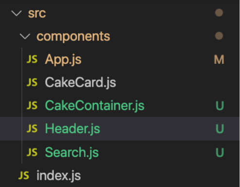
   <hr/>
  </details>
<br/>

  <li>
  Create a component in each file rendering a single div with the components name. This data is temporary, we are just using this div to prove to ourselves that our components are reaching the DOM and rendering on the browser. 


  </li>
    <details>
   <summary>
    solution 
   </summary>
   <hr/>
   Here's an example of the CakeContainer Component. Each component rendered by app should look similar.
    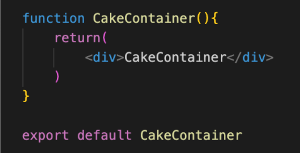
    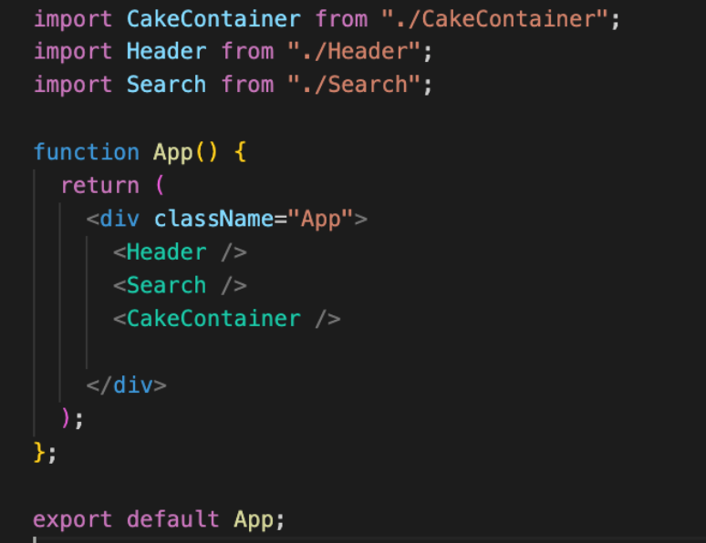
   <hr/>
  </details>
<br/>

  <li>
  Create a data folder and cakesData.js, add the following data to the data/cakesData.js

  ```
  export const cakes = [
    {
        flavor: 'Vanilla',
        size: '6" cake',
        price: 40.00
    },
    {
        flavor: 'Raspberry Cardamom Rose',
        size: '9" cake',
        price: 50.00
    },
    {
        flavor: 'Pink Champagne',
        size: 'cup cake',
        price: 37.5
    },
    {
        flavor: 'Earl Grey',
        size: 'cup cake',
        price: 18.00
    },
    {
        flavor: 'Black Forest',
        price: 18.00
    }
]

  ```
  </li>
  
<br/>

  <li>
  Import the data to the App. Notice we are using export instead of using export default in data/cakeData.js. We are doing this because we will eventually export more data from this file. When we import that data in our App we will need to use {} to access it.

  
  <details>
   <summary>
    solution 
   </summary>
   <hr/>
    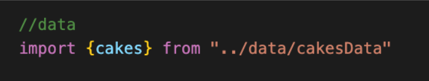
   <hr/>
  </details>
<br/>

  <li>
    Pass cakes as props to the CakeContainer. Name the prop key cakeList.   
    Add Props to the CakeContainer params, verify the cake list is in props via your react devtools by selecting the CakeContainer. 
</li>
  
  <details>
   <summary>
    solution 
   </summary>
   <hr/>
    
    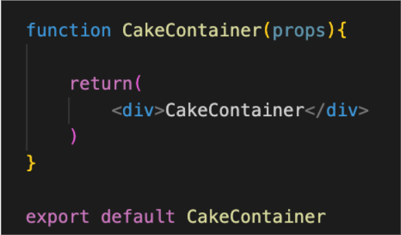
    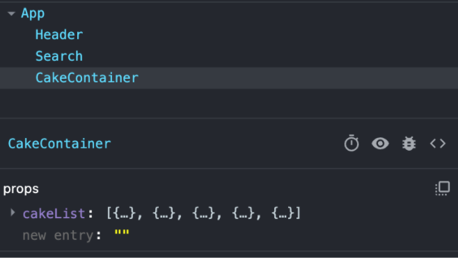
   <hr/>
  </details>
<br/>
  <li>
   Dynamically render a CakeCard for every cake in your cakeList using map.
  </li>
  
  <details>
   <summary>
    solution 
   </summary>
   <hr/>
    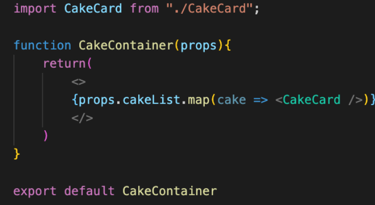
   <hr/>
  </details>
<br/>
  <li>
   Pass the CakeCard the mapped cake object as a prop
  </li>
  
  <details>
   <summary>
    solution 
   </summary>
   <hr/>
    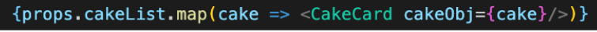
  
   <hr/>
  </details>
<br/>

 <li>
Refactor your CakeCard to render your new cakeObj 
 </li>
  
  <details>
   <summary>
    solution 
   </summary>
   <hr/>
    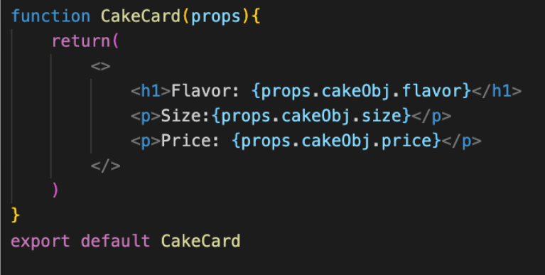
  
   <hr/>
  </details>
<br/>
</ol>
</ol>

### Bonus
<ol>
  <li>
  Dry this up a bit by destructuring cakeObj from props.
  </li>
  <details>
   <summary>
    solution 
   </summary>
   <hr/>
    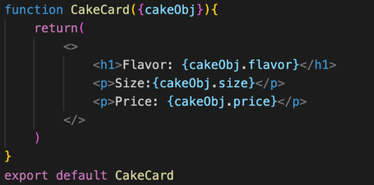
   <hr/>
  </details>
<br/>
  <li>
  Destructure cakeObj another level so that you can access props with the variables flavor, size and price. 
  </li>
  <details>
   <summary>
    solution 
   </summary>
   <hr/>
   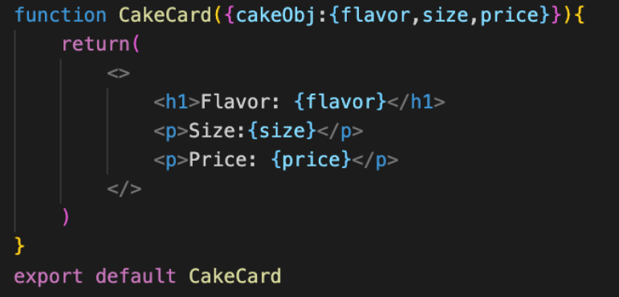
   <hr/>
  </details>
<br/>
  <li>
  Now you can set default values! The last cake is missing a size. Set a default value for size so a cake is never missing a size value.
  </li>
  <details>
   <summary>
    solution 
   </summary>
   <hr/>
    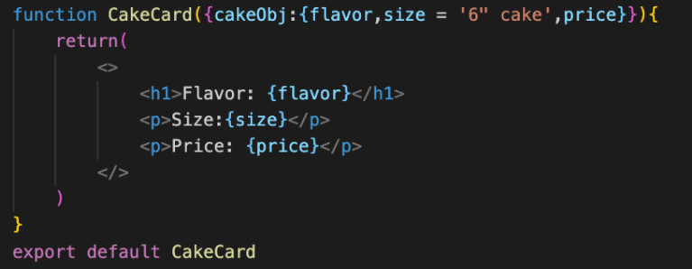
   <hr/>
  </details>
<br/>
</ol>


