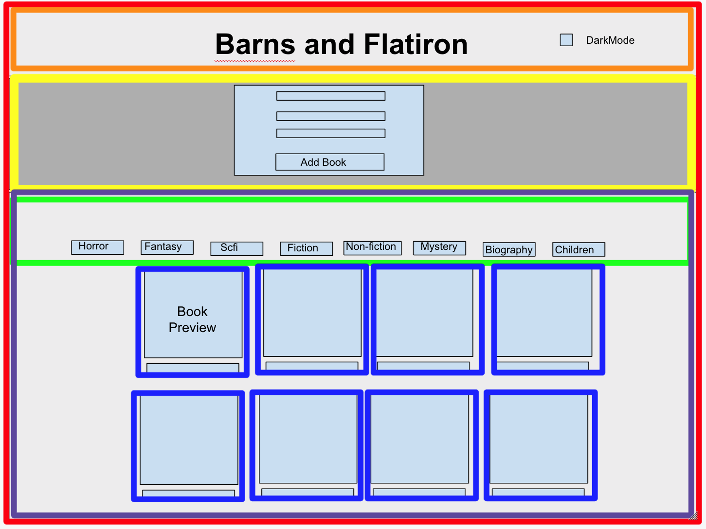

# Components and Props
## SWBAT
[] Organize code into files and use the import-export syntax to pass data between components  
[] Explain what a React Component actually is in code  
[] Use JSX to build custom components and render them in the browser  
[] Use props to make components more dynamic and reusable  

### Organization
We want to make sure our code is separated out into distinct sections. Our components should be function-specific and reusable when possible. Additionally, functionality for our logic and our rendering should be in separate components.   

Lets take a look at our wire-frame wire-frame component-diagram   




Our components should be in a components folder, and our index.js should stay in the root of src since its main responsibility should be to tie our components to the DOM.

For every component we've identified we should create a file with a matching name. Our file structure should look similar to this.

```
├── node_modules
├── .gitignore
├── package.json
├── README.md
├── public
└── src
    ├──  index.js
    └──  components
        ├── App.js
        ├── BookContainer.js
        ├── BookCard.js
        ├── Header.js
        ├── GenreMenu.js
        └── Form.js
```

### Props
"Conceptually, components are like JavaScript functions. They accept arbitrary inputs (called “props”) and return React elements describing what should appear on the screen." The react docs honestly put it best here. Props are our components inputs. Those inputs become the parameter variable for the components children.

```
function App(){
   return(
     <>
        <Cat name='rose' age='9'/>
     </>
   )
}; 

function Cat(props){
      return(
     <>
        <h1>{props.name}</h1>
        <p>{props.age}</p>
     </>
   )

}
```