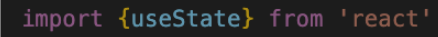
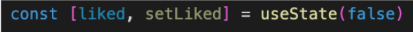
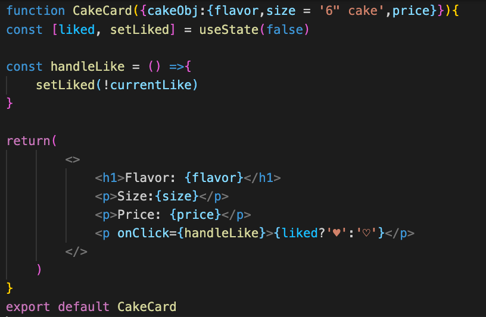
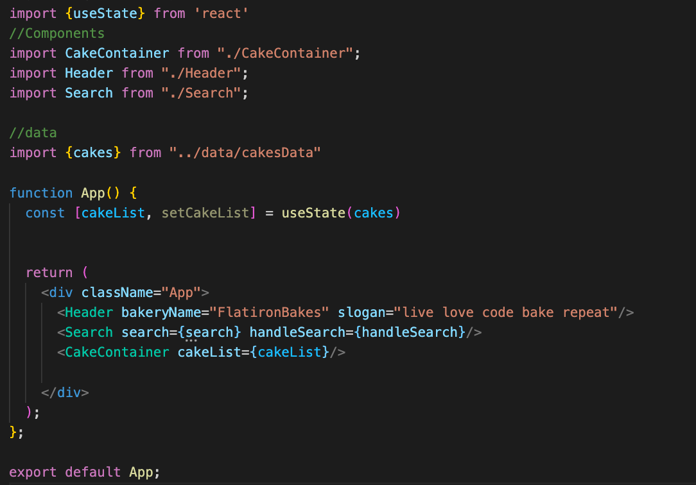

# Breakout Activity

## Note on feedback: C.A.S.K
Consensual, Actionable, Specific, Kind.   
Feedback is an important part of improving as a developer, but it’s important that we deliver it in a constructive way.

- C - Consensual: ask if you can give someone feedback
- A - Actionable: feedback should be actionable, avoid words like “good” or “bad”
- S - Specific: feedback needs to be specific, avoid generalizations. 
- K- Kind: don’t be a jerk.

## Deliverables
You will be updating component state with React!

>Note: If you get stuck, review Event Handling in React & React State in phase-2 canvas.

<ol>
  <li>
  Put a like on CakeCard and control it with state.
  <ul>
    <li>In the CakeCard Import useState from react </li>
     

      

        solution 
      

      

        
      

     

     
    <li>Implement useState to create a ‘liked’ state variable and ‘setLike’ method that updates state. Set liked to false by default.</li>
       

      

        solution 
      

      

        
      

     

      
    <li>Add a ternary that will render a '♥' if the liked state is true or a '♡' if the state is false. (control + command + spacebar will open the emoji menu on mac)</li>
      

      

        solution 
      

      

        
      

     

      
     <li>Create a clickHandler that will toggle the liked state. 
      

      

        solution 
      

      

      
     

     

   
    </li>
   </ul>
  
  <li>
  Review what useState is doing
  <ul>
    <li>
    `{liked?'♥':'♡'}`
     What is this ternary doing?
    </li>
    <li>
    Why is only ONE CakeCard being updated when we click the liked button? 
    </li>
     <li>
    What is the liked state variable and what value does it hold when our component renders for the first time? 
    </li>
     <li>
    If we refresh the page does the like persist? Why or why not?
    </li>
    <li>
    What is the setLiked method and what does it do?
    </li>
  </ul>
  </li>
 
<h3>Bonus</h3>
<li>
  Refactor our App component to manage cakes in state.
</li>
       

      

        solution 
      

      

        
      

     

      

</ol>