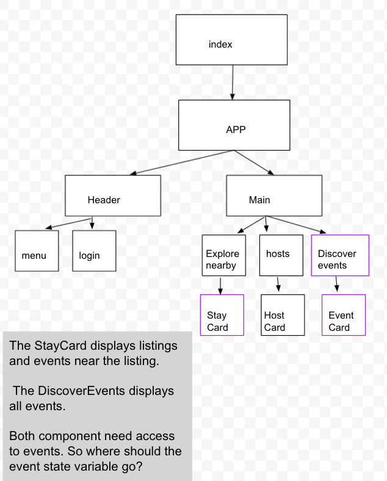
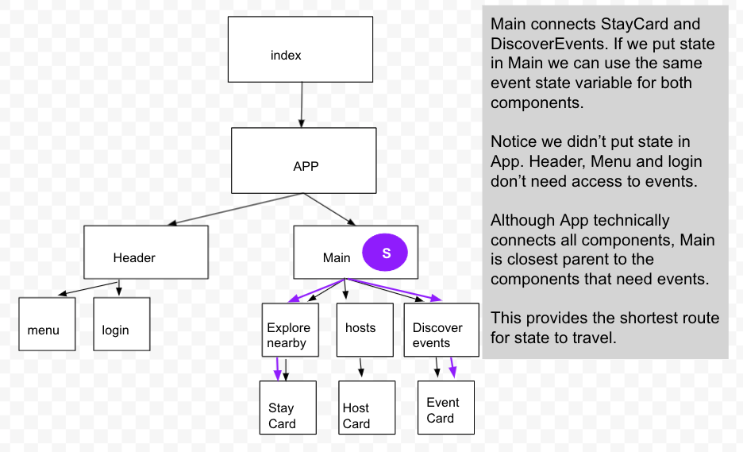
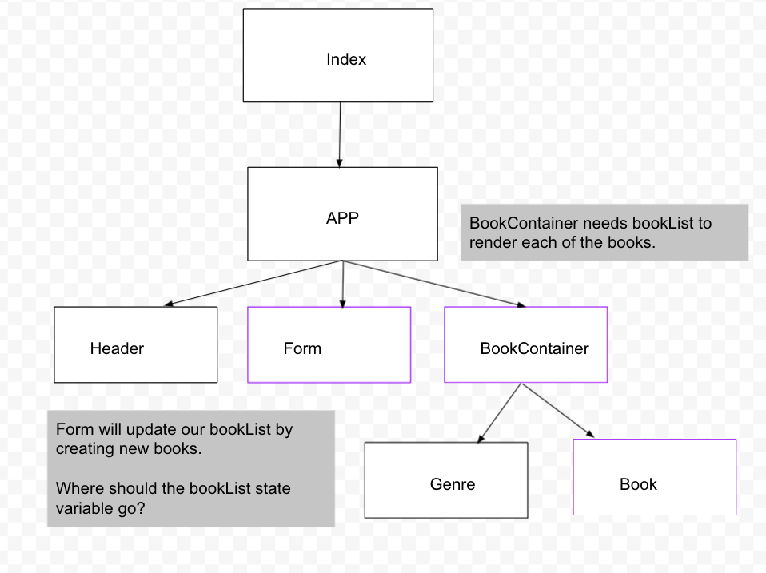
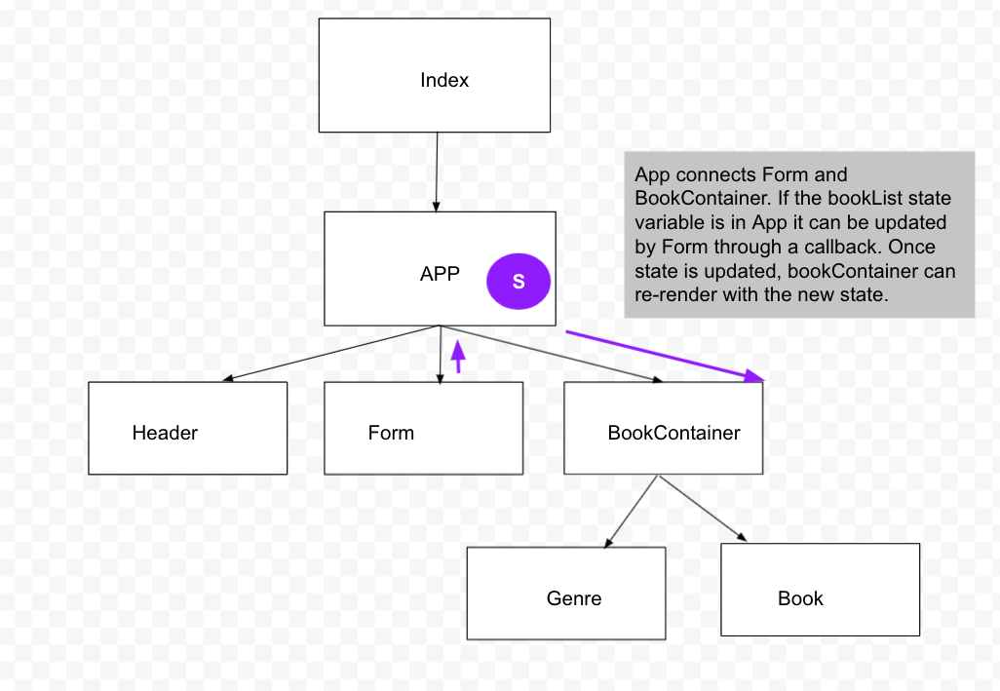
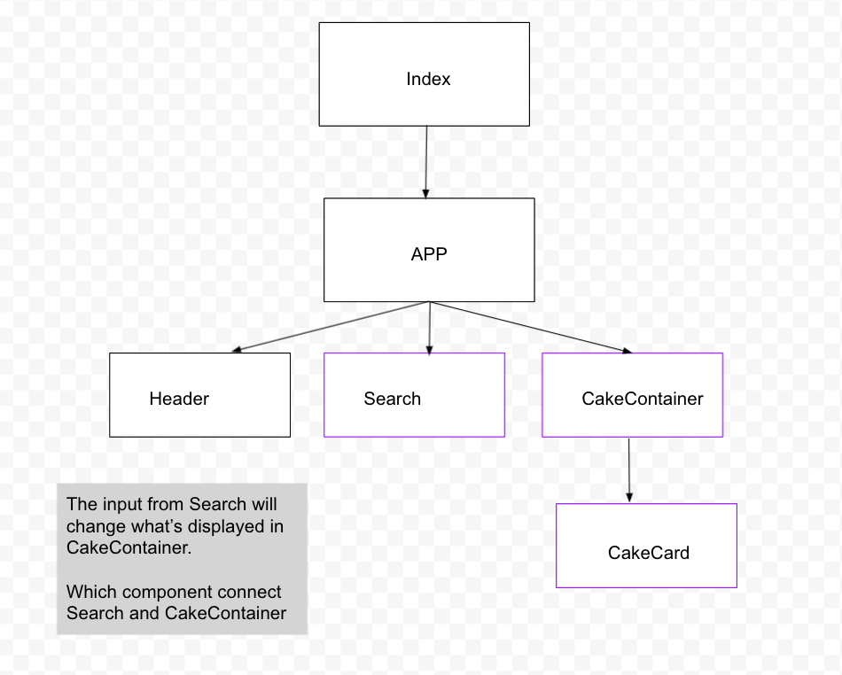
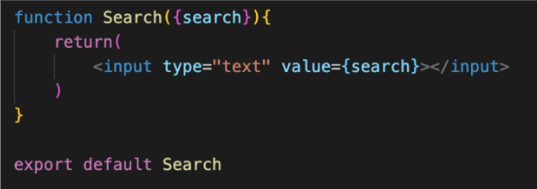
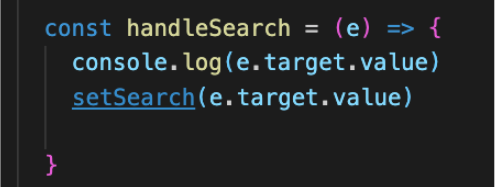
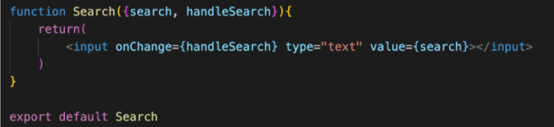

# Breakout Activity

## Note on feedback: C.A.S.K
Consensual, Actionable, Specific, Kind.   
Feedback is an important part of improving as a developer, but it’s important that we deliver it in a constructive way.

- C - Consensual: ask if you can give someone feedback
- A - Actionable: feedback should be actionable, avoid words like “good” or “bad”
- S - Specific: feedback needs to be specific, avoid generalizations. 
- K- Kind: don’t be a jerk.

## Deliverables
Take some time to practice mapping out state and controlling the flow of information through your react app.

>Note: If you get stuck, review 
React Information Flow

<ol>
  <li>
  Before coding lets take a look at the component hierarchy of a few react apps and figure out where we should define state.
  <ul>
    <li>This is a Travel App. While it will eventually have many state variables focus on events for this exercises. Multiple components need the same data. The data is only flowing one direction. From Parent to Child. Which component should we define the event state variable in? </li>
        
     

      

        solution 
      

      

        
      

     

     
    <li>Take a look at this book app. The bookList data in this app is needed by multiple components. It will need to go both from Parent to Child and from a Child to a Parent (through a callback). </li>
    
       

      

        solution 
      

      

        
      

     

      
    <li>This last app is the bakery app we’ve been working on. CakeList is needed in multiple components. The data will need to go both from Parent to Child and from a Child to a Parent (through a callback).</li>
         
       

      

        solution 
      

      

        
      

     

      
   </ul>
  
  <li>
  Time to code. Use the search bar to filter the cakes by flavor. 
  <ul>
    <li>
    In App import useState. Create a search state variable and setSearch method and pass the search variable down to the Search component through props. Build out the Search component to have an input with a value set to the search.
    </li>
          

      

        solution 
      

      

       
        This example destructure search from props, but you can also access search with props.search if you don't wan't to destructure.
      
     

     

   
    <li>
    If we type anything in the search bar nothing happens, we need to add an event to capture the change event from our input. Create a handle search function in App, it should take the event as a param and call setSearch with the event.target.value
    Note: This is an input using an onChange and does NOT have a onSubmit event so we don’t need event.preventDefault
    </li>
    

    

      solution 
    

    

    
     

     

      
     <li>
    Pass this search handler to the search component through props
    </li>
    

    

      solution 
    

    

    
     

     

      
     <li>
    Add an onChange to the input and pass it the search handler 
    Note: The event argument is coming from the onChange under the hood. We do not see it passed here and we don’t need to invoke the handler. onChange will do that for us.  
    </li>
    

    

      solution 
    

    

    
     

     

      
    <li>
    Test your input in the browser and you should see some values showing up in the search bar.
    Take a moment to review what we did.
    How is our handleSearch getting the event from our search Component?
    </li>
    <li>
    We will need to control cakes in state in order to filter it. SKIP THIS PART IF YOU DID THE BONUS YESTERDAY, add ‘cakeList’ to App and ‘setCakeList’ to state and set it to our cake data by default
    </li>
    

    

      solution 
    

    

    
     

     

      
 
<li>
  In our handler call setCakeList and filter our cakes based on their flavor.
  Note: This search bar is case sensitive, at the moment. Feel free to fix that as a challenge. 
</li>
     

    

      solution 
    

    

    
     

     

      
 
<li>
Review what we did
  <ul>
    <li>
    What does the .includes function do when it’s called on a string?
    </li>
     <li>
    What is our filter doing?
    </li>
     <li>
    Why are we using the e.target.value instead of the search state?
    </li>
  </ul>
</li>
</ol>