# Breakout Activity

## Note on feedback: C.A.S.K
Consensual, Actionable, Specific, Kind.   
Feedback is an important part of improving as a developer, but it’s important that we deliver it in a constructive way.

- C - Consensual: ask if you can give someone feedback
- A - Actionable: feedback should be actionable, avoid words like “good” or “bad”
- S - Specific: feedback needs to be specific, avoid generalizations. 
- K- Kind: don’t be a jerk.

## Deliverables
Create a controlled form. 

A controlled form is a form that derives its input values from state. It gives us more control of the form values opening up more functionality and flexibility. 

>Note: If you get stuck, review React Forms Submit and BONUS: React Forms Abstraction from phase-2 canvas.

<ol>
<li>
  Think about our search input from yesterday. Is this a controlled form, why or why not? If it's not a controlled form how would you make it a controlled form. 
</li>
  

      

        solution 
      

      

      Our search is not quite a controlled form. The input is controlled however we aren't actually using our search input to filter the cakes. 
      This input is not a full form. To make it a controlled form we will need to nest it in a form tag and add an onSubmit. 
     

     

   
  <li>
  Create a Form component with an input for flavor, image, size, price and type submit.
    

      

        solution 
      

      

      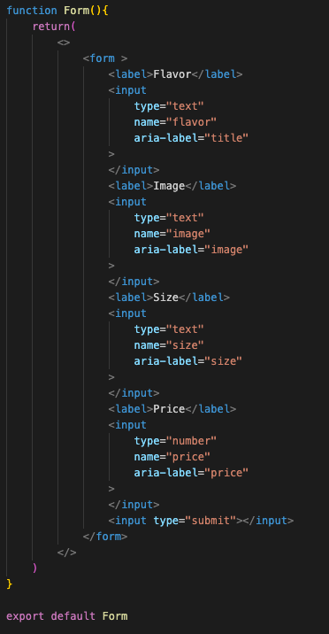
     

     

   
    <li>
    Create state for each of our inputs 
    NOTE: we will be refactoring this portion of the form. If you are comfortable with the onchange here feel free to skip to part 6.
    </li>
    

    

      solution 
    

    

    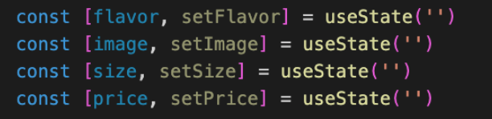
     

     

      
     <li>
    Set the value of each input to its matching state variable 
    </li>
    

    

      solution 
    

    

    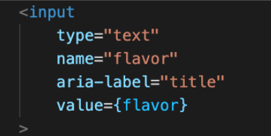
     

     

      
     <li>
    Create a handleChange for each input that updates the state onChange  
    </li>
    

    

      solution 
    

    

    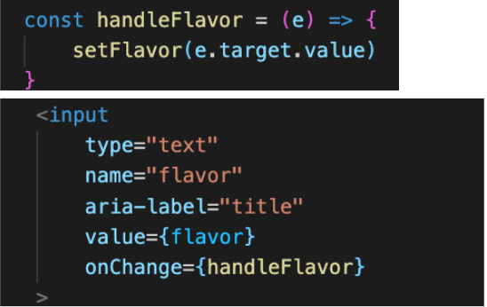
     

     

      
    <li>
    Test this out in the browser, our inputs should be working correctly and appearing in state. 
    Lets refactor this to be a bit cleaner, create one formData object for state and delete the rest of the state variables
    </li>
    

    

      solution 
    

    

    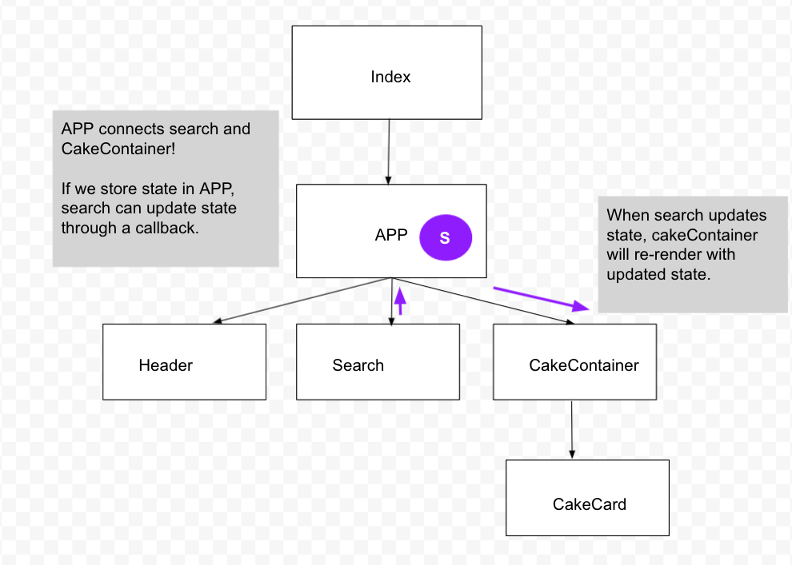
     

     

      
 
<li>
Update the form values to use formData
</li>
     

    

      solution 
    

    

    
     

     

      
 
<li>
Update all of the onChanges to point to single handleChange and delete the other handlers in Form.

For now console.log the e.target.value to assure the handleChange is working.
</li>
     

    

      solution 
    

    

    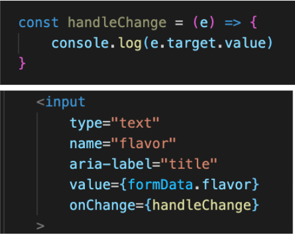
     

     

      
 
<li>
Update the handleChange to be dynamic based on the event target. Hint: You'll need to use the spread operator here. 
</li>
     

    

      solution 
    

    

    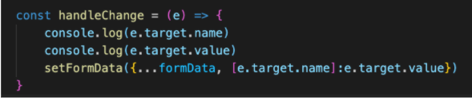
     

     

      
 
<li>
Check for understanding
Confirm your understanding of our dynamic handleChange by discussing these questions with your group. 

  <ul>
    <li> 
    What is e.target.name and e.target.value ?
    </li>
    <li>
    What is the spread operator and what is it doing here? {...formData}
    </li>
    <li>
    What is [e.target.name]:e.target.value doing after formData?
    </li>
  </ul>
</li>

<li>
Out inputs are now controlled. Lets add a cake to state!
In App, create a handleAddCake function and pass it through props to the Form. For now the handler should only console log the parameter cake.
</li>
     

    

      solution 
    

    

    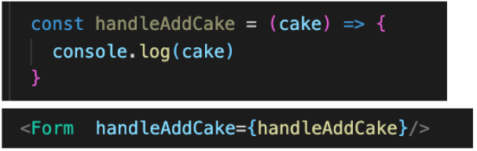
     

     

      
 
<li>
In form destructor handle Add cake from props 
</li>
     

    

      solution 
    

    

    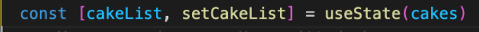
     

     

      
 

<li>
In Form, create a handleSubmit function that console.logs our formData
</li>
     

    

      solution 
    

    

    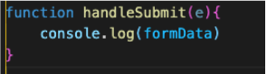
     

     

      
 
<li>
Add an onSubmit to the form tag and pass it handleSubmit
</li>
     

    

      solution 
    

    

    
     

     

      
 
<li>
Add e.preventDefault and invoke handleAddCake with the form data passed as an argument. 

</li>
     

    

      solution 
    

    

    
     

     

      
 

<li>
Back in App, in the handleAddCake function remove the console.log and add the new cake to the cakeList. Use the spread operator to make a copy of cakeList when adding the new cake. 

Test this out in the browser and add a new cake!
</li>
     

    

      solution 
    

    

    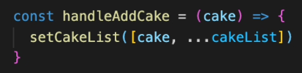
     

     

      
 
<h3>Bonus</h3>
Note: This is a particularly hard and intentionally vague bonus. If you don't get to it, you're still in a good place. 
<li>
Add an edit feature to our app OR change the search form into a controlled form.
</li>
</ol>