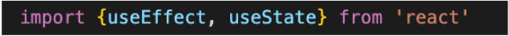
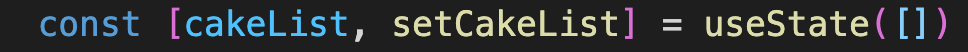
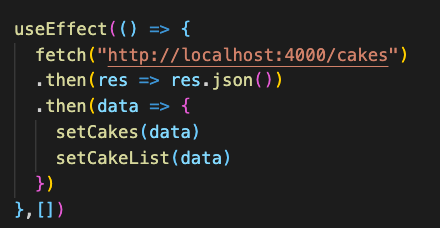
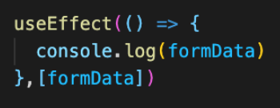

# Breakout Activity

## Note on feedback: C.A.S.K
Consensual, Actionable, Specific, Kind.   
Feedback is an important part of improving as a developer, but it’s important that we deliver it in a constructive way.

- C - Consensual: ask if you can give someone feedback
- A - Actionable: feedback should be actionable, avoid words like “good” or “bad”
- S - Specific: feedback needs to be specific, avoid generalizations. 
- K- Kind: don’t be a jerk.

## Deliverables
Refactor our application to use http and useEffect

>Note: If you get stuck, review 
The useEffect Hook and Data Fetching in React.

<ol>
<li>
  You will start populating your app with data from a GET request. Start by Convert data to db.json. An example can be found below. 
  Delete your import from cakesData.js. After the refactor, rename your cakesData.js to cakesData.json.
  <a href="https://github.com/learn-co-students/Phase-2-Lecture-Activity-Flatiron-Bakes-101121/blob/main/src/data/cakeData.json"> Click here for Json example </a>

</li>
 
<li>
Import useEffect from react. Change the default value of cakeList to be an empty array.
    

      

        solution 
      

      

      
     
     

     

   
    <li>
   Start your json server with `json-server --watch port 4000 cakeData.json`.
   Implement useEffect to make a fetch for cakes and set it to state.
    </li>
    

    

      solution 
    

  
  >Note: If you are not seeing a route for your cakes in your terminal and instead are seeing posts, comments, and profile. You ran your json-server command in the wrong directory. Make sure you are in the same directory as `cakeData.json`.   
  
  >Note: If you are getting an endless loop of fetch calls, double check that you've added the dependency array.

  

    
     

     

      
     <li>
    Check for understanding
    </li>
      <ul>
        <li>
        What is a side effect?
        </li>
        <li>
        What is useEffect?
        </li>
        <li>
        What is the dependency array?
        </li>
        <li>
        How can we implement useEffect to make a fetch call when the component renders for the first time. 
        </li>
      </ul>
    
  <h3>Bonus</h3>
     <li>
      Run useEffect to track an update in state. For example console.log when a new cake is added or console.log when the formData is updated.
    </li>
    

    

      solution 
    

    

    
     

     

      
   
</ol>