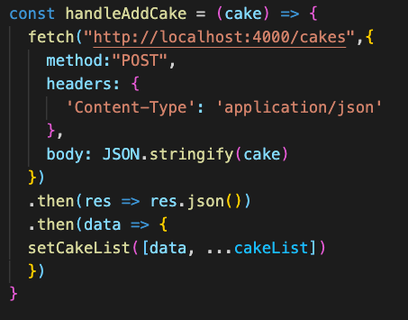
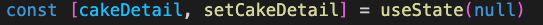
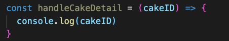
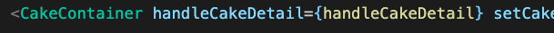
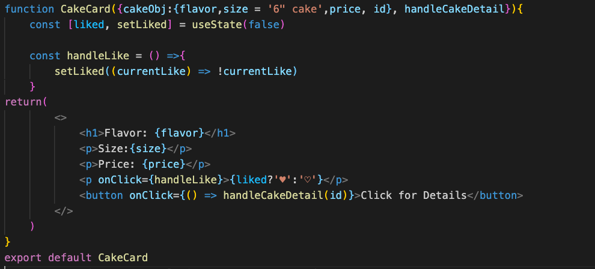
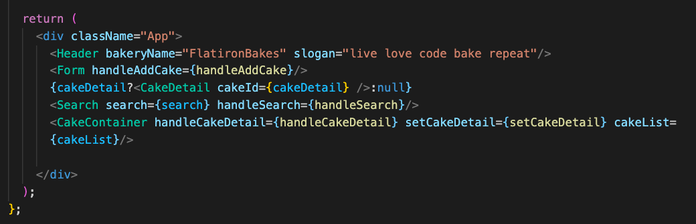
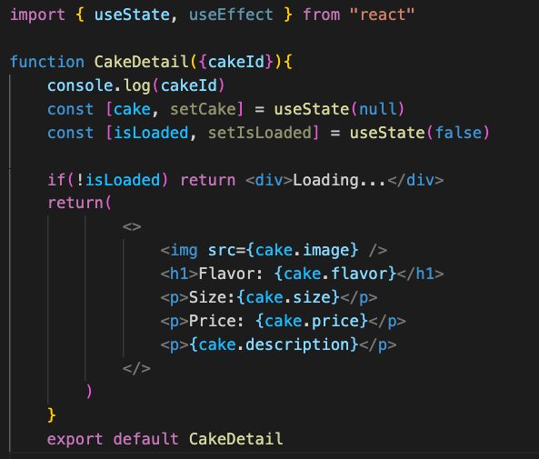
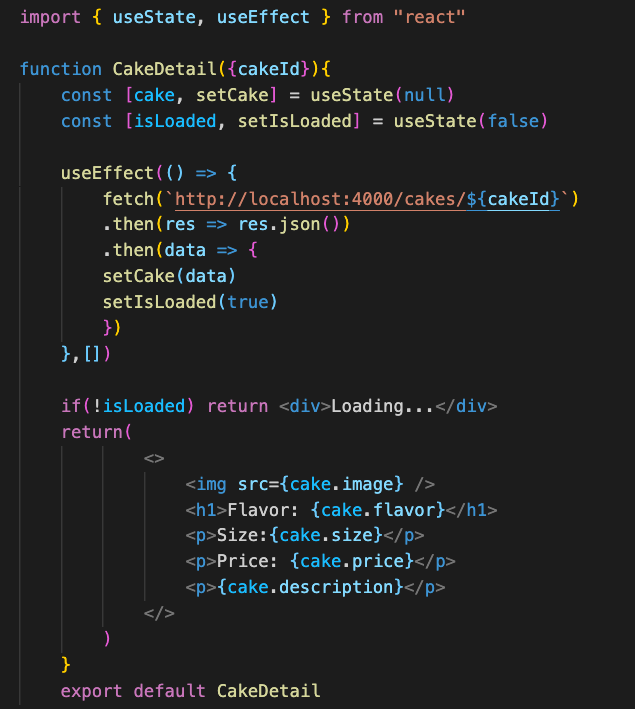
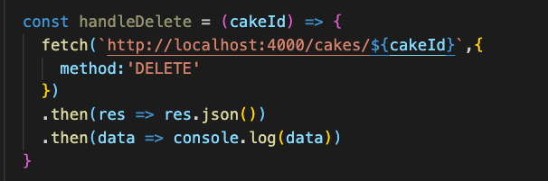
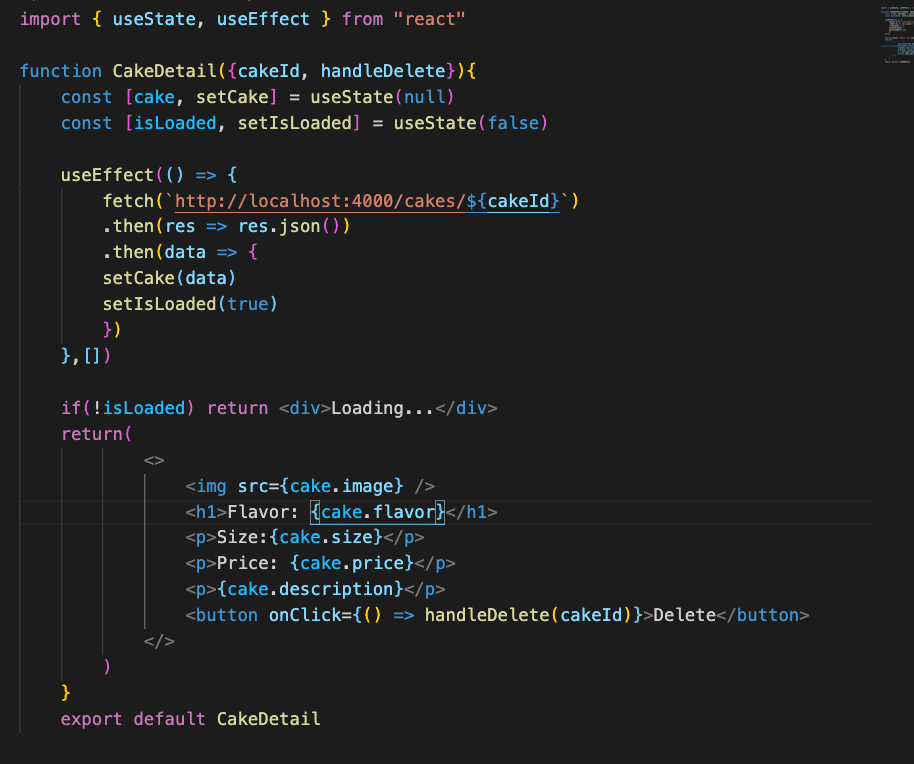

# Breakout Activity

## Note on feedback: C.A.S.K
Consensual, Actionable, Specific, Kind.   
Feedback is an important part of improving as a developer, but it’s important that we deliver it in a constructive way.

- C - Consensual: ask if you can give someone feedback
- A - Actionable: feedback should be actionable, avoid words like “good” or “bad”
- S - Specific: feedback needs to be specific, avoid generalizations. 
- K- Kind: don’t be a jerk.

## Deliverables
Refactor our application to use Post, Patch and Delete 

>Note: If you get stuck, review 
React Fetch CRUD Codealong

<ol>
<li>
Run your server with `json-server --watch --port 4000 cakeData.json`
</li>
<li>
  If your data already has a <b>liked</b> and <b>id</b> attribute on every cake skip this step. 
  
  Update your cakes in your db.json to have a <b>liked</b> attribute set to `false` and an <b>id</b> attribute to ALL OF THE CAKES. 
  <a href="https://github.com/learn-co-students/Phase-2-Lecture-Activity-Flatiron-Bakes-101121/blob/main/src/data/cakeData.json"> Click here for Json example </a>

</li>
 
<li>
Post some data. Where do you think this post method should go? What parts of state does it need? Find the function that handles adding a cake to state from your form. Create a POST request to `http://localhost:4000/cakes` that will send a cake to your json server. Practice rendering pessimistically by moving the functionality that sets the cake to state to the second then in our fetch request.
    

      

        solution 
      

      

      Since the post needs access to cakeList, its best to put it in APP.
      
     

     

   
    <li>
  Review useEffect and fetching data. 
  
  Clicking on a cake Detail button should render a CakeDetail component. 

  In app create a cakeDetail variable in state and set it to null with a setCakeDetail method.

  create a handleCakeDetail method that takes a cakeId and console.logs it for now. Pass it to CakeContainer and CakeCard
    </li>
    

    

      solution 
    

  

    
    
    
    
     

     

      
     <li>
    In CakeCard destructure id from the cakeObj and handleCakeDetail from props. Add a 'Click for Details button' with an onClick. Pass the onClick handleCakeDetail and pass it the id. 
    </li>
    

    

      solution 
    

    

    
     

     

      
    <li>
    When you click for details you should be seeing the Id of the cake in the console. Back up in app call setCakeDetail in handleCakeDetail and pass it the cake id. Do some set up for a CakeDetail component you'll make in the next step. Import `import CakeDetail from './CakeDetail';` and in App return a ternary that will render the CakeDetail component if cakeDetail has a value, else it will render null. Pass the CakeDetail component, cakeDetail as cakeId
    </li>
    

    

      solution 
    

    

    
     

     

      

  <li>
    Time to make the CakeDetail component. This component will need useState and useEffect. Create two state variables, cake set to null with a setCake method and isLoaded set to false with a setIsLoaded method. Above the return create a single line if statement `if(!isLoaded) return 
Loading...
` This says, if isLoading is false return this div that says Loading.... This will keep our component for erroring out while we make a fetch request in the next step. In the return of CakeDetail render the cake information.
    </li>
    

    

      solution 
    

    

    
     

     

      
    <li>
    Build a useEffect in CakeDetail that makes a fetch to `http://localhost:4000/cakes/${cakeId}` when the component loads for the first time. When the data returns set the cake to state and set isLoaded ot true.
    </li>
    

    

      solution 
    

    

    
     

     

      
  <h3>Bonus</h3>
     <li>
    Delete a cake. Create a handleDelete in App and pass it down to cake detail. The handleDelete should take an id and make a Delete fetch request that destroys a cake. For now confirm the cake was deleted with a console.log. In CakeDetail add a delete button with an onClick. Pass the handleDelete to the onClick with the cakeId. Refresh the page to confirm the cake was removed. As an additional bonus you can remove the cake from state. (not shown in solution.)
    </li>
    

    

      solution 
    

    

    
    
     

     

      
</ol>