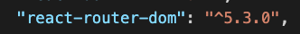
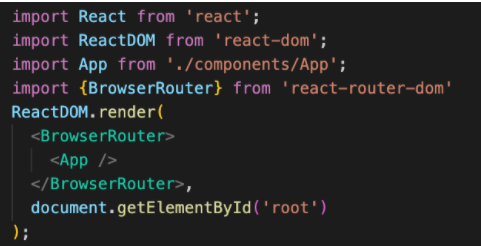
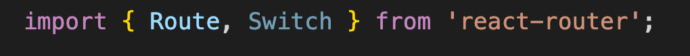
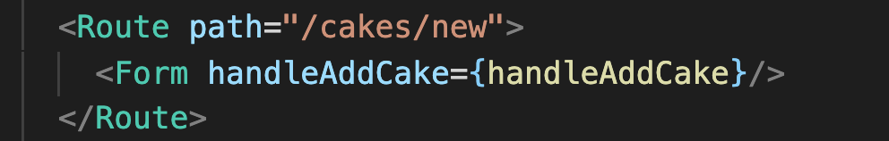
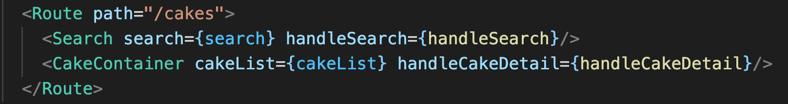
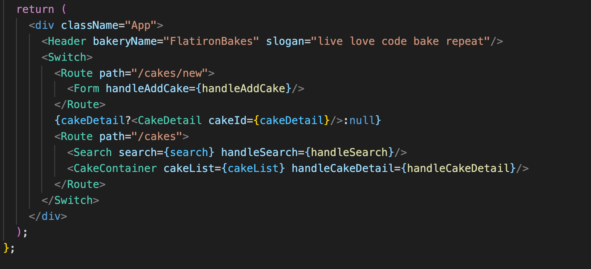
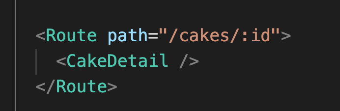

# Breakout Activity

## Note on feedback: C.A.S.K
Consensual, Actionable, Specific, Kind.   
Feedback is an important part of improving as a developer, but it’s important that we deliver it in a constructive way.

- C - Consensual: ask if you can give someone feedback
- A - Actionable: feedback should be actionable, avoid words like “good” or “bad”
- S - Specific: feedback needs to be specific, avoid generalizations. 
- K- Kind: don’t be a jerk.

## Deliverables
Refactor your app to handle client side routing with React Router. We will be working with React Router DOM 5.3.0 

>Note: If you get stuck, review 
React Router Code-Along

<ol>
<li>

In the root of your directory (The same level as the package.json) install react router dom **5.3.0** with the following. 

 `npm i react-router-dom@5.3.0`   

 Review your package json to verify you have the correct package and version.

  

      

        solution 
      

      

      The following should be under dependencies
      
     

  

   
</li>
<li>
 
 Run your server with the following `json-server --watch --port 4000 cakesData.json`

</li>
 
<li>
Navigate to your index.js and set up BrowserRouter. Import react browser router and wrap your app component in your BrowserRouter component.
  

      

        solution 
      

      

      
     

     

   
<li>

Create your first route in App. Start by importing Route and Switch from 'react-router-dom'. Nest the Form component in a Route tag. Add `path="/cakes/new"` to the Route tag.

Verify your code in the browser. The Form should be gone, if you put `http://localhost:3000/cakes/new` in the url bar the form should re-appear. 

</li>
    

    

      solution 
    

  

     
     

    
     

     

      
  <li>
    Nest your Search and CakeContainer inside a route with the path of “/cakes”.
    Verify your code in the browser. `http://localhost:3000` should only be displaying the header component. `http://localhost:3000/cakes` should display the Search and CakeContainer Components
  </li>
    

    

      solution 
    

    

    
     

     

      

  <li>
    Nest all of the routes in a Switch from react router dom.
    Verify your code in the browser. Now, when you go to  `http://localhost:3000/cakes/new`, you should only see the Form and Header and `http://localhost:3000/cakes` should only show the Search  CakeContainer and Header
  </li>
    

    

      solution 
    

    

    
     

     

      
  
<h3>Bonus</h3>

  <li>
    Create Dynamic routes. Delete the ternary rendering CakeDetail, remove cakeDetail from state and delete handleCakeDetail. You'll need to remove handleCakeDetail from props as well.
    Create a new route that renders Cake detail with the path `/cakes/:id`. The :id will be the dynamic part of the route.
  </li>
    

    

      solution 
    

    

    
     

     

      

  <li>
    Import `Link` to CakeCard. Replace the Click for Details Button with a Link component.
    Verify the Click for Details link renders to the CakeDetail component
  </li>
    

    

      solution 
    

    

    
     

      

</ol>
