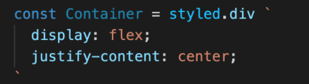

# Breakout Activity

## Note on feedback: C.A.S.K
Consensual, Actionable, Specific, Kind.   
Feedback is an important part of improving as a developer, but it’s important that we deliver it in a constructive way.

- C - Consensual: ask if you can give someone feedback
- A - Actionable: feedback should be actionable, avoid words like “good” or “bad”
- S - Specific: feedback needs to be specific, avoid generalizations. 
- K- Kind: don’t be a jerk.

## Deliverables
Refactor and style your app with styled components!

If you get stuck review the following.
- [Flex Box](https://css-tricks.com/snippets/css/a-guide-to-flexbox/)   

- [Grid](https://css-tricks.com/snippets/css/complete-guide-grid/)   

- [Pseudo Classes](https://www.w3schools.com/css/css_pseudo_classes.asp)   

- [Color Picker](https://htmlcolorcodes.com/color-picker/)

- [Animations](https://developer.mozilla.org/en-US/docs/Web/CSS/CSS_Animations/Using_CSS_animations)

<ol>
<li>
Start the server 
`Server command: json-server --watch --port 4000 cakeData.json`

  

      

        solution 
      

      

      
     

  

   
</li>
<li>
Create the styled component,(I like to organize them at the bottom of the file.)
Name the component
Set it to ‘styled.element’
Add css between ` `.
Nest the JSX elements you'd like to style between your styled component. 
  

      

        solution 
      

      

      
     

     

   
<li>

<h3> Style your applications however you want! </h3>  
<h3>Bonus: Style a nested element using a styled component </h3>  
<h3>Bonus: Create a reusable variable using theme and props</h3>   

</ol>