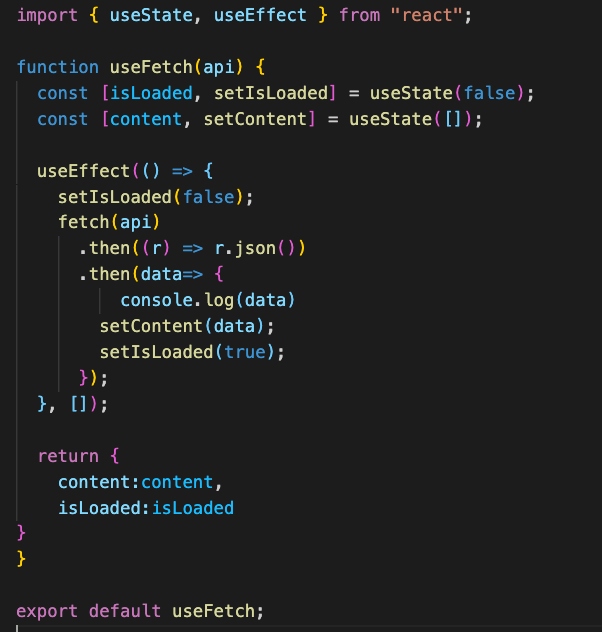
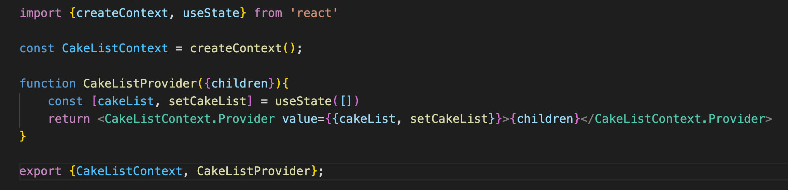
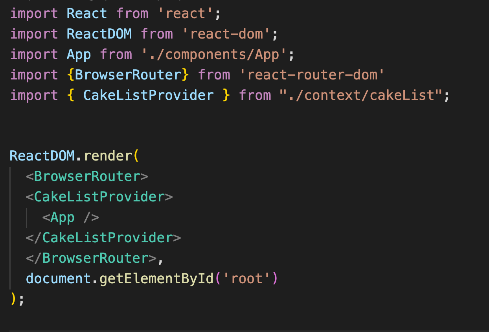
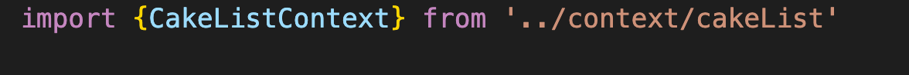

# Breakout Activity

## Note on feedback: C.A.S.K
Consensual, Actionable, Specific, Kind.   
Feedback is an important part of improving as a developer, but it’s important that we deliver it in a constructive way.

- C - Consensual: ask if you can give someone feedback
- A - Actionable: feedback should be actionable, avoid words like “good” or “bad”
- S - Specific: feedback needs to be specific, avoid generalizations. 
- K- Kind: don’t be a jerk.

## Deliverables
Create your own hook and/or use context
>Note: Review Custom hooks and React Context if you get stuck
<ol>
<li>
Start the server 
`Server command: json-server --watch --port 4000 cakeData.json`

Create a custom hook for cakeDetails fetch request. Create a hooks folder with a useFetch.js file.
  

      

        solution 
      

      

      
     

  

   
</li>
In useFetch import useState and useEffect.
Create a function called useFetch and pass it a url as a param. Create a state variable context and set it to an empty array and isLoaded and set it to false. Implement useEffect so that it executes a fetch request using the url param. when the fetch resolves it should set content to the response data and isLoaded to true. Return content and isLoaded in an object.
<li>

  

      

        solution 
      

      

      
     

     

   
</li>

<li>
Use the hook in CakeDetail and replace the useEffect and useState with useFetch.
  

      

        solution 
      

      

      
     

     

   
</li>
<h3>Bonus: Add context to your app</h3>   
<li>
Move your cakeList from local state to context.
 Create a context folder and a cakeList.js. 
  

      

        solution 
      

      

      
     

     

   
</li>

<li>
This is very new and complicated, don't be afraid to look  at the solution for this one. 

Import createContext and useState to `cakeList.js`. Create a constant called CakeListContext and set it to `createContext()`. Create a function called `CakeListProvider`. When react calls the CakeListProvider it will pass your components to it as an argument. So, in the CakeListProvider function we need to destructor a param called children (  `function CakeListProvider({children}){}` ). Inside the CakeListProvider create a state variable cakeList and set it an empty array. Return CakeListContent.Provider as a component. Pass it the value of an object with cakeList and setCakeList through props. Nest the children param between the opening and closing tags of the CakeListContext.Provider and export CakeListContext and CakeListProvider. 
  

      

        solution 
      

      

      
     

     

   
</li>
<li>
In index.js import the CakeListProvider and wrap App with it.
  

      

        solution 
      

      

      
     

     

   
<li>

In APP import useContext from react and CakeListContext. call useContext and pass it CakeListContext as an argument. Destructure cakeList and setCakeList from useContext. Remove cakeList from state and verify your app still works
  

      

        solution 
      

      

      
     

           
     

     

   
</li>

</ol>