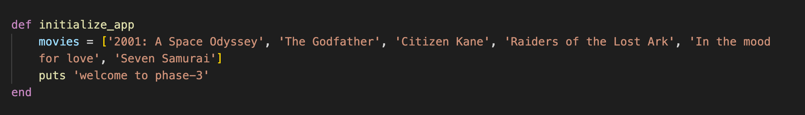
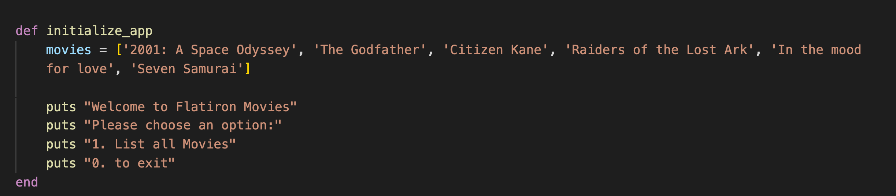
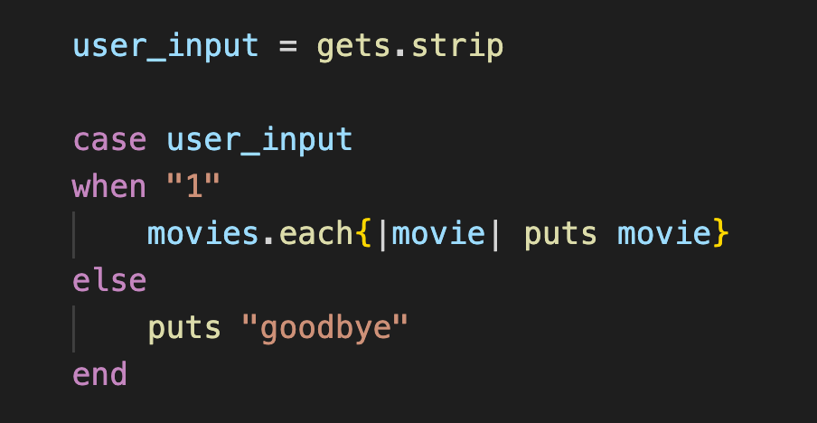
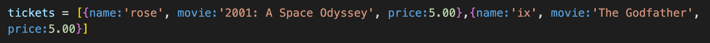
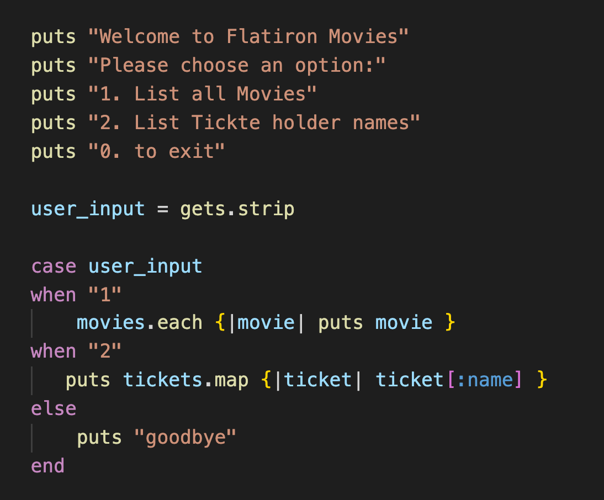

# Activity
[Starter Code](https://github.com/learn-co-students/Phase-3-movie_app_101121)

# Run the APP
1. cd into movies_app
2. In the terminal, run `bundle install`
2. In the terminal, run  `ruby ./bin/run.rb` to start the CLI
3. If the following error message is returned: zsh: permission denied: ./bin/run.rb, run the following command: `chmod +x ruby ./bin/run.rb`

If you see 'welcome to phase-3' print in your terminal you should be good to go.

You'll have to re-run the app every time you run a command going forward. 

# Deliverables 
A local theater has asked you to make a CLI app to help them sell and track tickets. 

You will be doing all of the following in lib/cli.rb

1. Create a inside of the initialize_app called movies that is a list of movies. 
 

      

        solution 
      

      

        
      

     

 

2. Create a menu. Start by using puts to print a few strings. "Welcome to Flatiron Movies" ,  "Please choose an option:", "1. List all Movies", "0. to exit"

 

      

        solution 
      

      

        
      

     

 

3. Use `gets.strip` to get an input from a user. Create an if or case statement, with the following conditions. If the user inputs 1, iterate through the movies array and puts all the titles. else exit the application. 

 

      

        solution 
      

      

        
      

     

 

4. practice using a binding.pry. First put a binding.pry in the first case before movies. 
Next put one inside of the each iterating through movies (You'll need to break the each into multiple lines). run the app. When you get to the first pry type movies in the terminal to verify the movies array. type exit to continue to the next pry. type movie to verify the movie. type exit to continue to the next pry until you've looped through the entire array. Remove the binding.pry's once done.

 

      

        solution 
      

      

        
      

     

 

5. Bellow the movie array create a tickets array with a few tickets in it. The tickets should be hashes with a name, movie, id and price.

 

      

        solution 
      

      

        
      

     

 

6. Add a puts to your menu '2. List ticket holder names'. Add a case "2" to your case statement that puts an array of the names of everyone who has a ticket. (map)

 

      

        solution 
      

      

        
      

     

 

7. Create a method that will create a ticket. Add a puts '3. Add ticket', and a case that calls that method. (You do not need to add the ticket to the tickets array)

 

      

        solution 
      

      

        
        
      

     

 

### Bonus

8. Find a ticket by a name
10. Filter out tickets by a specific title
11. Update every ticket price by 1 dollar
12. Move the puts, user input and case statement into a menu method that takes the movies array and tickets array as params. call menu inside of initialize_app
13. At the end of every action return to the menu screen instead of exiting your app.
14. add a ticket to the tickets array once it's created
