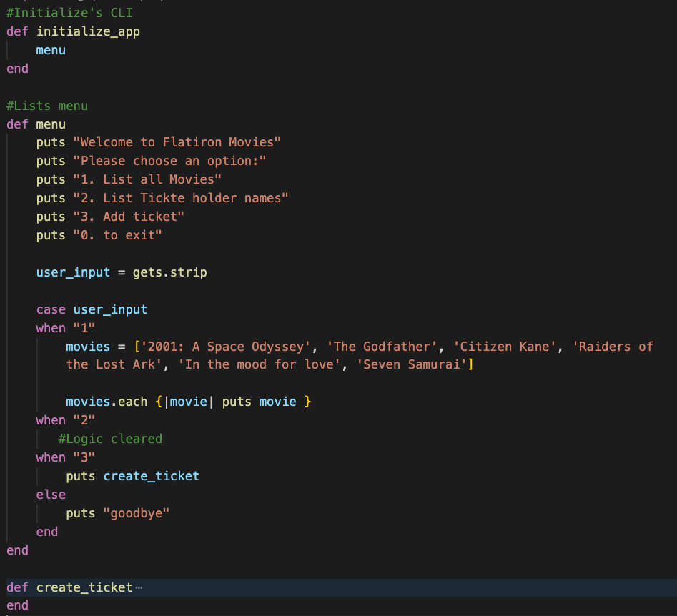
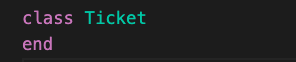
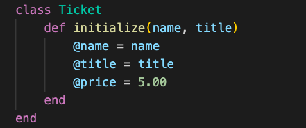
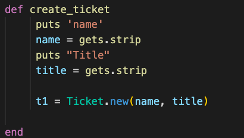
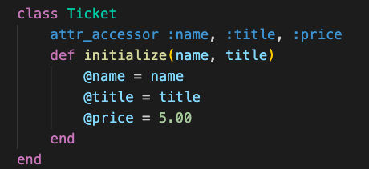
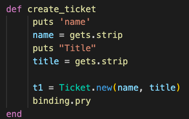
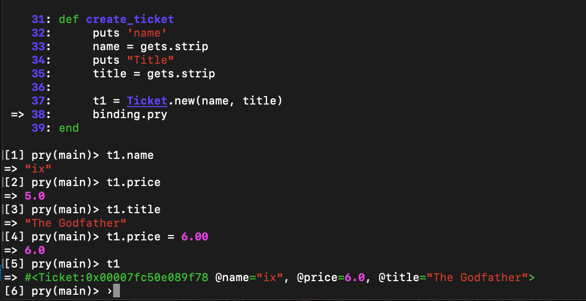
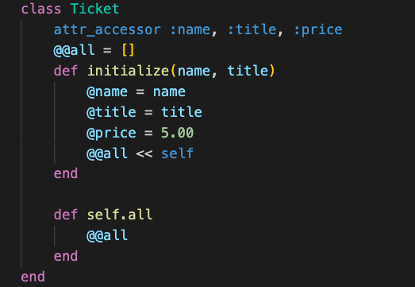
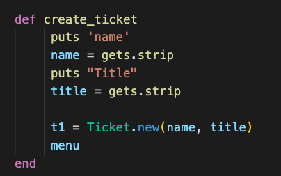

# Activity
[Starter Code](https://github.com/learn-co-students/Phase-3-movie_app_101121)

# Run the APP
1. cd into movies_app
2. In the terminal, run `bundle install`
2. In the terminal, run  `ruby ./bin/run.rb` to start the CLI
3. If the following error message is returned: zsh: permission denied: ./bin/run.rb, run the following command: `chmod +x ruby ./bin/run.rb`

If you see 'welcome to phase-3' print in your terminal you should be good to go.

# Deliverables 
Create a ticket class to add consistency and reusability and expand on features  

1. Start by cleaning up the CLI. Delete the ticket array and move the menu logic into it's own method. Call the menu method inside of initialize_app. The Movies array can be moved to the 1 case block. Delete the logic inside of the 2 case block.
 

      

        solution 
      

      

        
      

     

 

2. Create a new file. Ticket.rb in the lib folder. Create a Ticket Class in Ticket.rb. Back in cli.rb, refactor the create_ticket to puts Ticket.new to the console. Test that a Ticket is being created. You should see `#<Ticket:some mix of numbers and characters>` in the console.

 

      

        solution 
      

      

        
      

      
 In Ticket.rb 

        

        
        
      

     

 

3. In the Ticket class. Create an initialize method that takes a name, and a title as params. Create instance variables for name and title and set it to the params. Create an additional instance variable price and set it to 5.00.
 

      

        solution 
      

      

        
      

     

 

4. In cli.rb refactor create_ticket to use gets.strip to get a name and title from the user. Use those inputs as arguments to Ticket.new. Set Ticket.new to a variable `t1` (You wont be able to access ticket attributes quite yet)

 

      

        solution 
      

      

        
      

     

 

5. In Ticket.rb add `attr_accessor` to the top of the file with name, title and price. Add a binding.pry to the bottom of create_ticket in cli.rb. Run the app and test your code. When you get to the binding.pry verify that you can read name, title and price with. `t1.name`, `t1.title`, `t1.price`. Try setting the price to a new value, to assure that you can write to these instance variables.

 

      

        solution 
      

      

        
        
      

         
      

     

 

### Bonus

6. Add the @@all Class variable to 
7. Shovel self into @@all at the end of initialize
8. Create a class method accessing @@all

 

      

        solution 
      

      

        
      

     

 

9. In cli.rb, refactor the 2 case block to iterate over Ticket.all and print every ticket holder name. In Create Ticket, call the menu method after the ticket is created. Run your app, create a few tickets and run "2. List Ticket holder names"

 

      

        solution 
      

      

        
      

      
In Create Ticket

      

        
      

     

 

