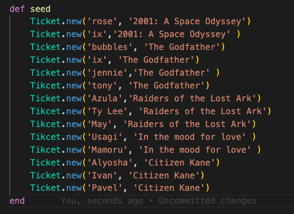
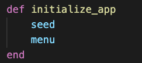
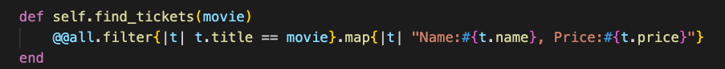
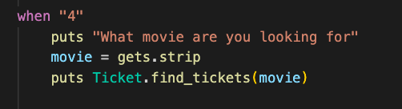
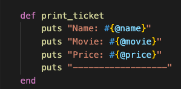
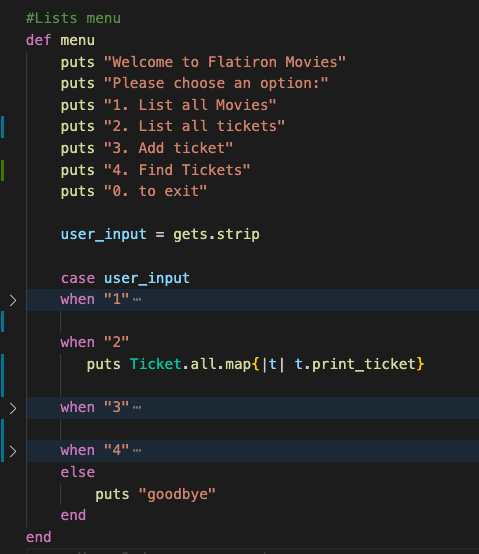
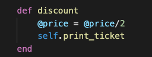
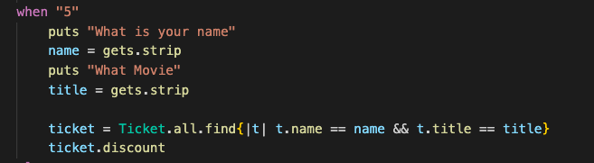
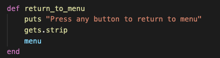
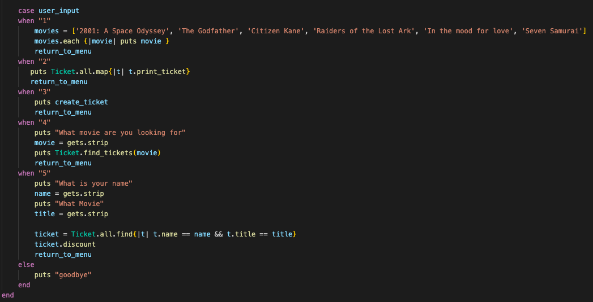

# Activity
[Starter Code](https://github.com/learn-co-students/Phase-3-movie_app_101121)

# Run the APP
1. cd into movies_app
2. In the terminal, run `bundle install`
2. In the terminal, run  `ruby ./bin/run.rb` to start the CLI
3. If the following error message is returned: zsh: permission denied: ./bin/run.rb, run the following command: `chmod +x ruby ./bin/run.rb`

# Deliverables 
Add CRUD and aggregate methods to ticket and create a new class
0. If you have already added @@all to tickets skip this step. Add '@@all = []' to Ticket. At the end of the instance method shovel in self to @@all. Create a class method that returns @@all.
 

      

        solution 
      

      

        
      

     

 

1. Create some default ticket data. In cli.rb create a method called seed that creates several tickets. Call seed in initialize_app.
 

      

        solution 
      

      

        
        
 Call seed 

        
      

     

 

2. Create a find_tickets class method that takes movie and finds every ticket with the matching title. The method should return an array of strings with the name and price of every ticket. 
> Hint: Try chaining two enumerable methods

Add a 4th option to cli.rb, get a movie input from the user and call Ticket.find_tickets with the user input as an argument.

 

      

        solution 
      

      

        
         
 Change CLI 

        
      

     

 

3. If you have already made print_ticket method Skip this part. Create a print_ticket instance method that prints the name, movie and price of a ticket. In Cli, Replace `2. List all ticket holder names` with `2. List all tickets`. In the 2 block iterate over Ticket.all and call print_ticket on every instance.
 

      

        solution 
      

      

        
        
 Change CLI (Note: the > to the left indicates the other blocks are collapsed there's still code there you just can't see it at the moment.) 

        
      

     

 

4. Create a instance method that discounts a tickets price by %50 and prints the ticket with the new price. Add a 5th option to cli.rb that finds a ticket based on name and movie, runs the discount method.
 

      

        solution 
      

      

        
        
 Change CLI  

        
      

     

 

5. In cli.rb create a method to run after every command that prints "press any button to return to menu" takes a user input and calls the menu method. Put this method at the end of every block in the case statement.
finds a ticket based on name and movie, runs the discount method.
 

      

        solution 
      

      

        
        
 Change case statement 

        
      

     

 

### Bonus

6. Add the @@all Class variable to 
7. Shovel self into @@all at the end of initialize
8. Create a class method accessing @@all

 

      

        solution 
      

      

        
      

     

 

9. In cli.rb, refactor the 2 case block to iterate over Ticket.all and print every ticket holder name. In Create Ticket, call the menu method after the ticket is created. Run your app, create a few tickets and run "2. List Ticket holder names"

 

      

        solution 
      

      

        
      

      
In Create Ticket

      

        
      

     

 

