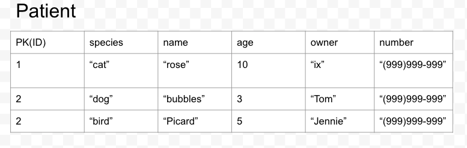
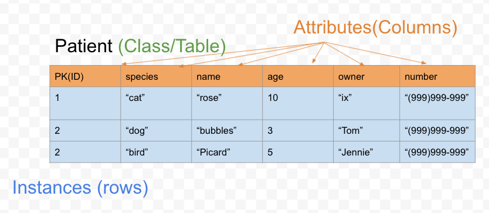
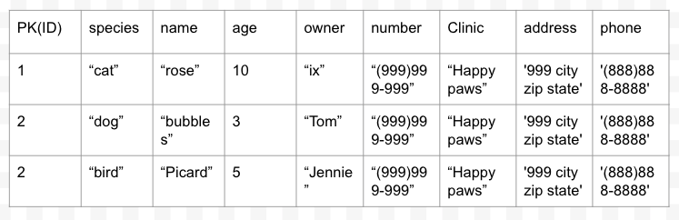
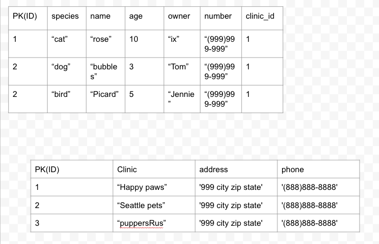

# Intro To Databases
## SWBAT
- [ ] Understand the benefits 
- [ ] Understand the Relationship between a database and API
- [ ] Implement a domain model
- [ ] Implement Mapping columns and rows to classes and instances 
- [ ] Implement Basic SQL queries
- [ ] Implement Primary keys
- [ ] Understand Foreign keys 

## The Project 
The Veterinary clinic that hired us has grown and has a bigger and has the budget to put towards their patent data management. Happy with the CLI we built for them, they will like us to create a database and API with GUI that's easy for their vets and vet techs to use. 
- React Front end (week 3)
- Database (SQL)
- ORM (ruby/active record/sinatra(week-3))
>Note: Database vs API
- Database holds data
- API is the interface that is the communicates between the server and client

## SQL (Structured Query Language)
- A language used to communicate with Databases 
- It allows us to create tables, insert data, update data, delete data, create simple and complex queries for data. 
- How do tables map to OOP

 <details>
      <summary>
        solution 
      </summary>
      <hr/>
        
      <hr/>
     </details>
<br/>

- Relationships through foreign key can help us avoid duplicate date.


 <details>
      <summary>
        solution 
      </summary>
      <hr/>
        
      <hr/>
     </details>
<br/>


```

CREATE TABLE clinic(
    id INTEGER,
    name VARCHAR(30),
    address VARCHAR(50),
    phone VARCHAR(10),
    PRIMARY KEY(id)
);

CREATE TABLE patient(
    id INTEGER,
    clinic_id INTEGER,
    species VARCHAR(30),
    name VARCHAR(50),
    age INTEGER,
    owner VARCHAR(50),
    number VARCHAR(15),
    PRIMARY KEY(id)
    FOREIGN KEY (clinic_id) REFERENCES clinic(id)
);


/* Add data */
INSERT INTO clinic (name, address, phone) VALUES ('Happy pets', '999 city zip state','(888)888-8888' );

INSERT INTO clinic (name, address, phone) VALUES ('Seattle pets clinic','999 city zip state','(888)888-8888' );

INSERT INTO patient (clinic_id, species, name, age, owner, number) VALUES (1, 'cat', 'rose', 10, 'ix', '(999)999-9999');
INSERT INTO patient (clinic_id, species, name, age, owner, number) VALUES (2, 'dog', 'bubbles', 2, 'Tom', '(999)999-9999');
INSERT INTO patient (clinic_id, species, name, age, owner, number) VALUES (1, 'bird', 'picard', 2, 'jennie', '(999)999-9999');

/* Query data */

SELECT * FROM patient

/* Update data */

UPDATE patient
SET  age = 11
WHERE id = 1;

/* Delete data */

DELETE FROM patient
WHERE name='bubbles'


/* relational query */

SELECT patient.name, clinic.name 
FROM patient
INNER JOIN clinic ON patient.clinic_id = clinic.id;

```

## ORM (Object Relational Mapping)
- Uses object oriented programming with database
- Combines SQL and Ruby
- Maps classes and instances to tables
- ORM's solve repetition and organization problems
> Note: CAUTION: Do no mix the two up. While we mimick our Ruby objects as records in the database, they are not the same thing. Ruby object != database record

```
# Mass Assignment 
    def initialize(attributes) 
        attributes.each do |key, value| 
            if self.respond_to?("#{key.to_s}=") 
                self.send("#{key.to_s}=", value) 
            end 
        end
    end

# Create database 
    def self.create_table 
        sql = <<-SQL
        CREATE TABLE IF NOT EXISTS patients (
            id INTEGER,
            clinic_id INTEGER,
            species VARCHAR(30),
            name VARCHAR(50),
            age INTEGER,
            owner VARCHAR(50),
            number VARCHAR(15),
            PRIMARY KEY(id)
        );
        SQL
        DB.execute(sql)
    end 

# Add data

    def save
         sql = <<-SQL
         INSERT INTO patient (species, name, age, owner, number) VALUES (?,?,?,?,?);        
         SQL

        DB.execute(sql, self.species, self.name, self.age, self.owner, self.number)
        @id = DB.last_insert_row_id
        self 
    end

# Query data


    def self.all 
        resources = DB.execute("SELECT * FROM patients")
        resources.map do |hash|
          self.new(hash)
        end
    end


```
