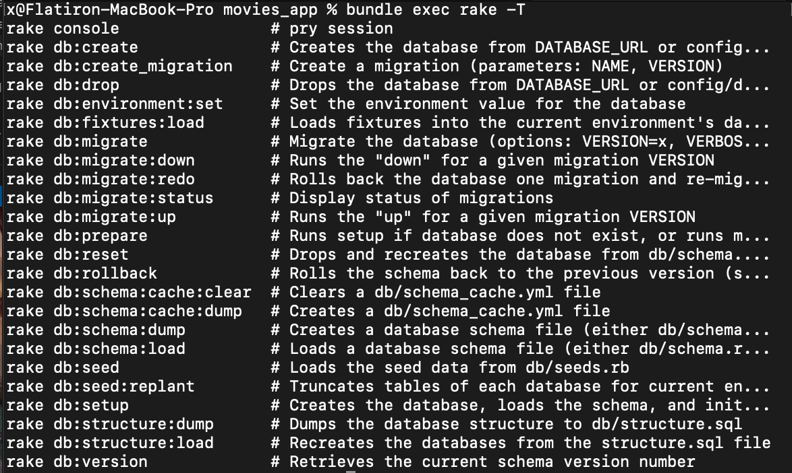
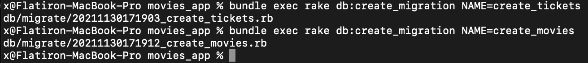
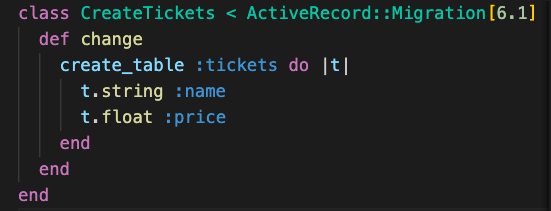
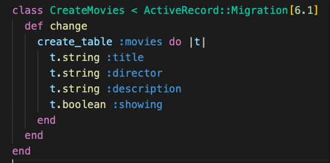
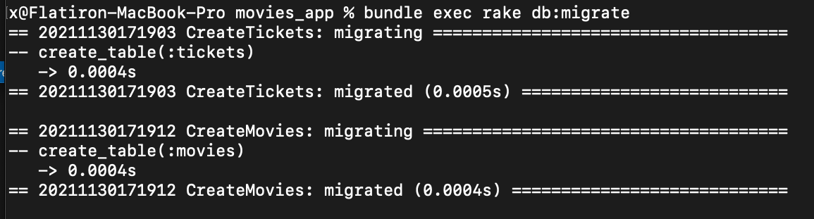
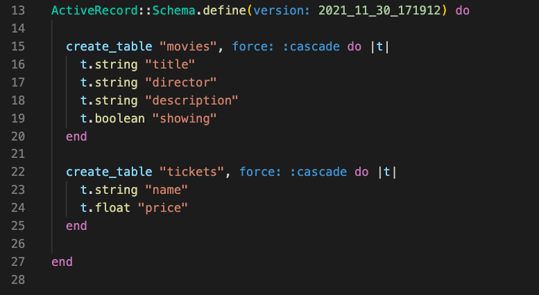
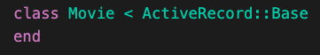
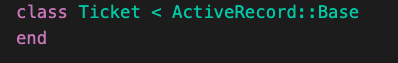

# Activity
Clone down the following 
[Starter](https://github.com/learn-co-students/Phase-3-movie_app_101121)


# Deliverables
Add migrations, schemas and practice active record methods in the console.
>Note: if you get stuck review 
Active Record Migrations, Writing Migrations, Intro to Rake, 


1. run `bundle install` after your gems have been installed/updated run ` bundle exec rake -T` to view your rake tasks. Use this as a reference whenever you need it. 
>Note: `rake -T` will work but calling `bundle exec` before commands prevents versioning errors.

 <details>
      <summary>
        solution 
      </summary>
      <hr/>
        
      <hr/>
 </details>

2. Use rake to create two migrations one named `create_tickets` and the other `create_movies  `
 <details>
      <summary>
        solution 
      </summary>
      <hr/>
        
      <hr/>
 </details>

3. The `db` folder should now have a `migrate` folder and two new files. You should see something similar to the following in each file, one file with CreateTickets and the other with CreateMovies.
```
class CreateTickets < ActiveRecord::Migration[6.1]
  def change
  end
end
```

Use create_table to create a table for each migration. tickets should have a name:string and price:float. movies should have title:string, director:string, description:string, showing:boolean. 


 <details>
      <summary>
        solution 
      </summary>
      <hr/>
        
           
      <hr/>
 </details>


 4. run `bundle exec rake db:migrate` to migrate your tables. Verify the schema.rb was created correctly.
  <details>
      <summary>
        solution 
      </summary>
      <hr/>
      
        
      
      <hr/>
 </details>

 5. Create a Ticket model and Movie Model that inherits from `ActiveRecord::Base`

   <details>
      <summary>
        solution 
      </summary>
      <hr/>
        
      
      <hr/>
 </details>

 6. Test out your active record commands in your console. run `rake console`
 and do the following.
  - create an instance of ticket or movie
  - save an instance of ticket or movie to the db
  - use a command that both creates an instance and saves it to the db at the same time.
  - display all of the resources from ticket or movie
  - display the first resource from ticket or movie
  - display the last resource from ticket or movie
  - find a specific resource by id
  - find a specific resource by a different attribute
  - update a single resource from ticket or movie
  - update all the resources from from ticket or movie at the same time
  - delete a single resource
  - delete all resources 

Bonus: Explore active record methods and see what they do. Here's a list of some helpful ones. 

Count
Average
Minimum
Maximum
Sum

find_or_create_by
order

where

