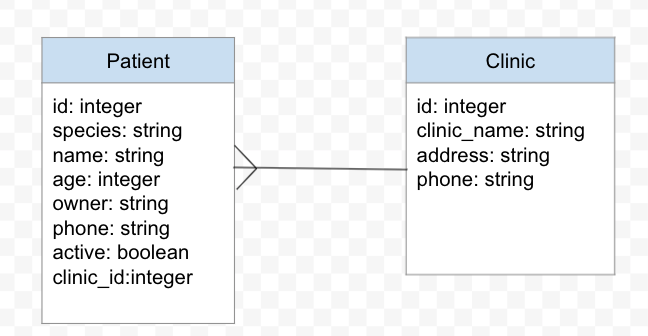

# Intro To Active Record
## SWBAT
- [ ] Implement Classes in active record
- [ ] Implement CRUD using active record methods
- [ ] Implement a domain model
- [ ] Use Schemas and Migrations to create a database
- [ ] Implement Seeds
- [ ] Run Rake Commands


## The Project 
The Veterinary clinic that hired us has grown and has a bigger and has the budget to put towards their patent data management. Happy with the CLI we built for them, they will like us to create a database and API with GUI that's easy for their vets and vet techs to use. 
- React Front end (week 3)
- Database (SQL)
- ORM (ruby/active record/sinatra(week-3))
>Note: Database vs API
- Database holds data
- API is the interface that is the communicates between the server and client

## Domain Model (Domain Driven Design)

- A little design beforehand prevents extra refactoring
- A visual representation of classes and relationships
- What models will the app need, what attributes do those models need.
- What will the models relationships look like and how does that change the structures of the table. 


## Class inheritance review
`<` indicates class inheritance. A class can inherit the methods and functionality of a parent class. 
In the example bellow Cat inherits `say_hi` and `make_appointment` from Patient. 

```
 class Patient 
     def say_hi
     puts 'hi'
     end 

     def make_appointment
       puts 'appointment'
     end 
 end 

 class Cat < Patient
     def say_meow
         puts 'meow'
     end 
 end

 p1 = Patient.new
 c1 = Cat.new

 p1.methods.length #60
 c1.methods.length #61
 
 c1.say_hi #'hi'

 p1.say_meow #will error super classes don't have access to a child classes methods
```

## Active Record 
- Active record is a ORM, it works with databases to perform CRUD actions. 

## Important folders
```
├── app
│   └── models
│       └── patient.rb
├── config
│   └── environment.rb
├── db
│   └── migrate
│       └── 20211130152235_create_patients.rb
├── Gemfile
├── Gemfile.lock
└── Rakefile
```

### APP(Models)
- Where your Models(classes) will live

### DB
- Your migrations, schema, database and seeds are all here.

### config/environment.rb
- Creates connection between active record and database 

### Rakefile
- Add custom rake tasks 


# Rake Commands 
- `rake -T` List commands 
```

rake console                # pry session
rake db:create              # Creates the database, needed for postgresql but NOT SQLite
rake db:create_migration    # Create a migration 
rake db:drop                # Drops the database 
rake db:migrate             # Migrate the database 
rake db:migrate:status      # Display status of migrations
rake db:reset               # Drops and recreates the database 
rake db:rollback            # Rolls the schema back to the previous version
rake db:seed                # Loads the seed data from db/seeds.rb

```

## Order of operation 
0. Draw out your domain models
1. Bundle install
2. Create Migrations
3. Create Tables
4. run  `rake db:migrate` and verify schema.rb
5. Create Models and relationships
6. Test Models and relationships in console 
7. Create Seeds verify seeds were created in console
8. Create custom methods and test each method in console as they are written