# Activity

# Deliverables
Add associations. 
- Our tickets should belong to one movie, a movie can have many tickets. 
- We also want some new models for managing our snack stand at the movie theater. 
  - A receipt can have many receipt_line_items, and many foods through receipt_line_items. 
  - A food can have many receipt_line_items, and many receipts through receipt_line_items. 
  - ReceiptLineItem will be the join model. A receipt_line_item belongs to a receipt and a food.

>Note: if you get stuck review 
One To Many Associations, Many To Many Associations and Active Record Association Methods.

0. Draw out a Domain Model for the following.

- one-to-many
  - Ticket: name, price movie_id
  - Movie: title, director, description, showing

- many-to-many
  - Receipt: customer_name
  - Food: food_name, price
  - ReceiptLineItem: receipt_id, food_id

1. If you haven't already, add an id column to tickets that references movie_id.
>
 

      

        solution 
      

      `bundle exec rake db:create_migration NAME=add_column_to_tickets`
      

        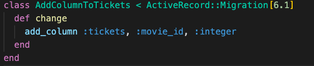
      

 

2. Use rake to create three migrations `create_receipt`, `create_food`, and `create_receipt_line_item` with the attributes listed in step 0.  
 

      

        solution 
      

      bundle exec rake db:create_migration NAME=create_receipts
      bundle exec rake db:create_migration NAME=create_foods  
      bundle exec rake db:create_migration NAME=create_receipt_line_items
      

        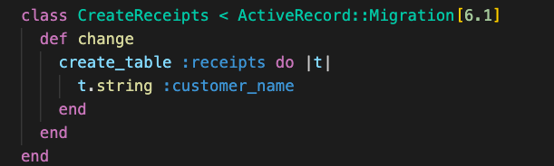
        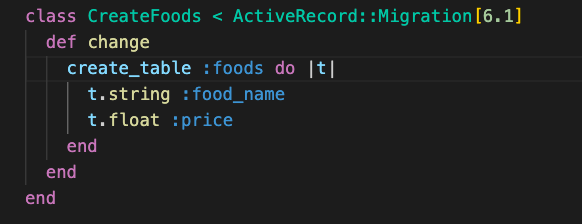
        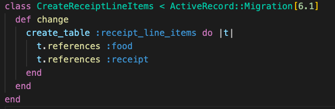
      

 

3. Create models for `Receipt`, `Food`, and `ReceiptLineItems` 
 

      

        solution 
      

      

        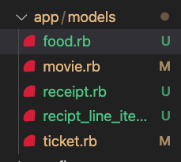
        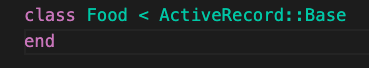
        
        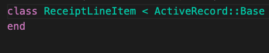
      

 

 4. run `bundle exec rake db:migrate` to migrate your tables. Verify the schema.rb was created correctly.
  

      

        solution 
      

      
        
      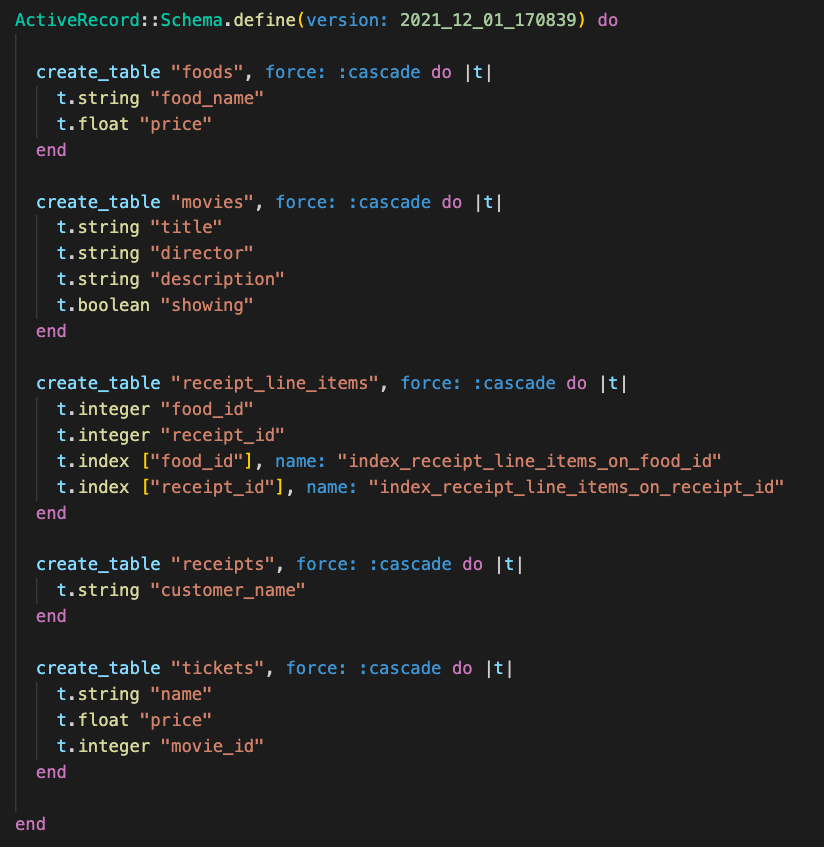
      

 

 5. Add a has many tickets association to the Movie model and a belongs to movie association to the Ticket model. 

   

      

        solution 
      

      

      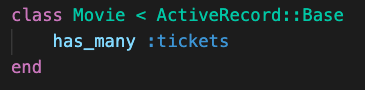
      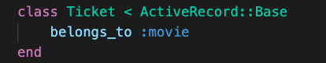
      

 

 6. Add two belongs to association to the ReceiptLineItem model. Add a has many receipt_line_items and a has many foods through receipt_line_items association to the Receipt model. Finally, add a has many receipt_line_items and a has many receipts through receipt_line_items association to the Food model.
   

      

        solution 
      

      

      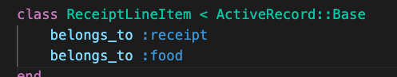
      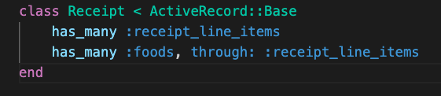
      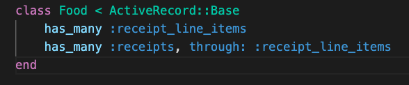
      

 

 7. Create some seed data and test these associations in the console. 

    

      

      

      

      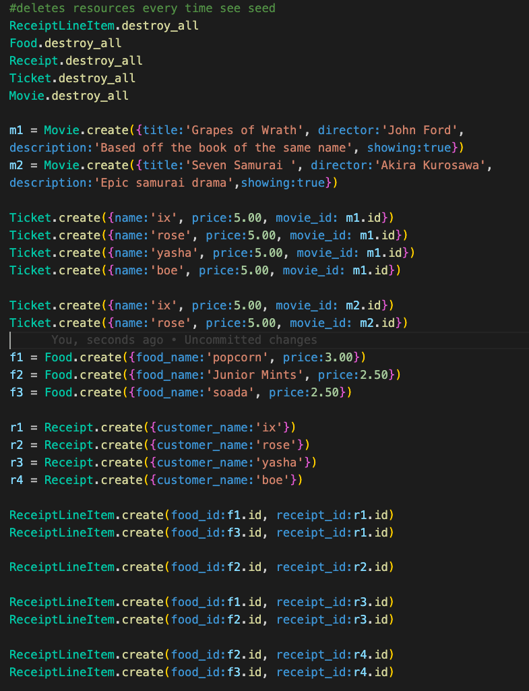
      

 

 