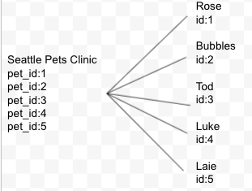
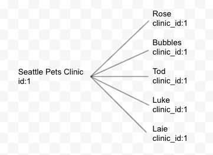
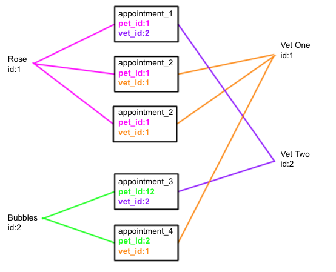

# Active Record Associations
## SWBAT
- [ ] Implement a one to many association with active record 
- [ ] Implement a many to many association with active record 

## The Project 
The Veterinary clinic that hired us has grown and has a bigger and has the budget to put towards their patent data management. Happy with the CLI we built for them, they will like us to create a database and API with GUI that's easy for their vets and vet techs to use. 
- React Front end (week 3)
- Database (SQL)
- ORM (ruby/active record/sinatra(week-3))
>Note: Database vs API
- Database holds data
- API is the interface that is the communicates between the server and client

## Domain Model

## One to Many
- What's the problem with storing a bunch of foreign keys on one resource?
   

- Storing one foreign key on many resources is much cleaner, easier to query and prevents bugs

In a one to many a foreign key is stored on many models to reference one. 

## Many to Many/ Has many through

In a many to many we store the foreign keys on a join model. 
Each of the models have many join models giving it a many to many relationship through the join. 

