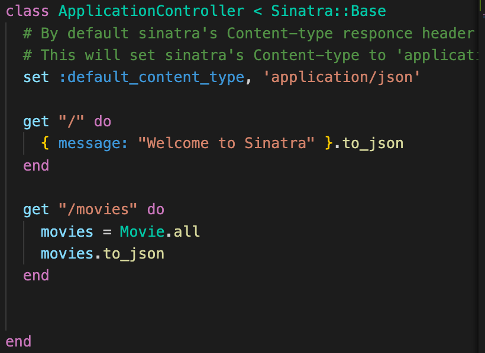
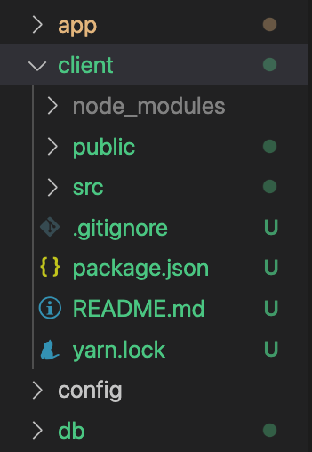
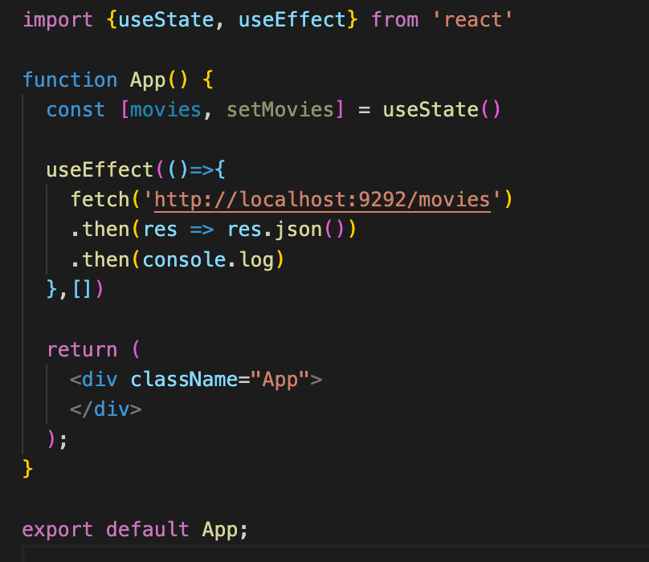
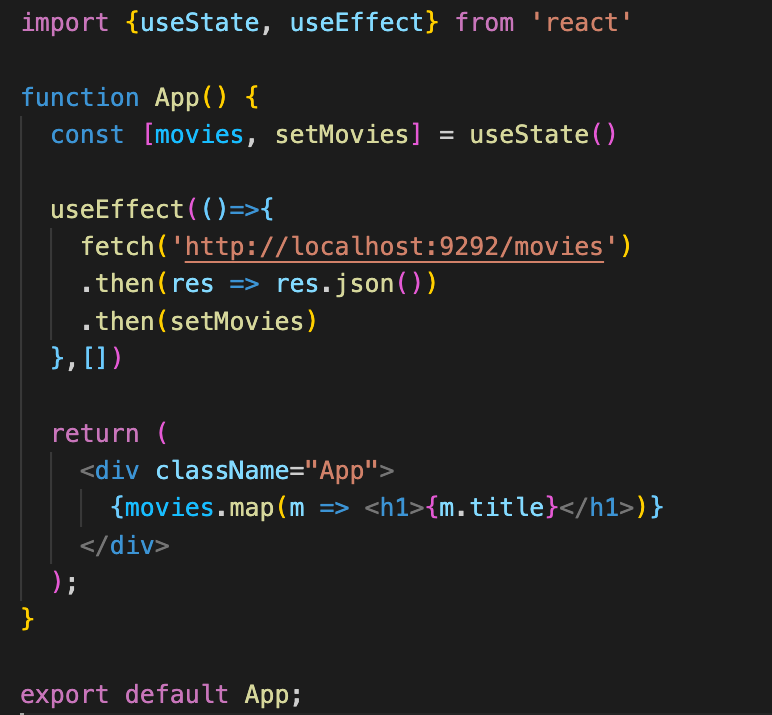

# Activity
[Clone down starter code here](https://github.com/learn-co-students/Phase-3-movie_app_101121) 

# Deliverables
Create sinatra routes 

>Note: if you get stuck review Sinatra with Active Record: GET Requests
>Note: `bundle exec rerun -b 'rackup config.ru'` will run your server.

0. Clone down the starter code and run bundle and migrate. Verify your migration was successful. Review your models to verify the associations are set up correctly. Create some seeds manually or using the faker gem.  

1. In ApplicationController create a GET route for Movies. Run your server with `bundle exec rerun -b 'rackup config.ru'` if you haven't already. Verify your route in the browser at `http://localhost:9292/movies`.
 

      

        solution 
      

      

        
      

 

2. use create react app to create a client. `npx create-react-app client`
 

      

        solution 
      

      

        
      

 

3. In the client, in App.js require in useState and useEffect. Create a fetch call with useEffect to the movies route that console.logs the response.
 

      

        solution 
      

      

        
      

 

 4. Set movies to state, and render the title of each movie in App.
  

      

        solution 
      

      
        
      
      

 

Bonus 

  5. Make a route for tickets and display every ticket with its name and price on the browser. 
 
