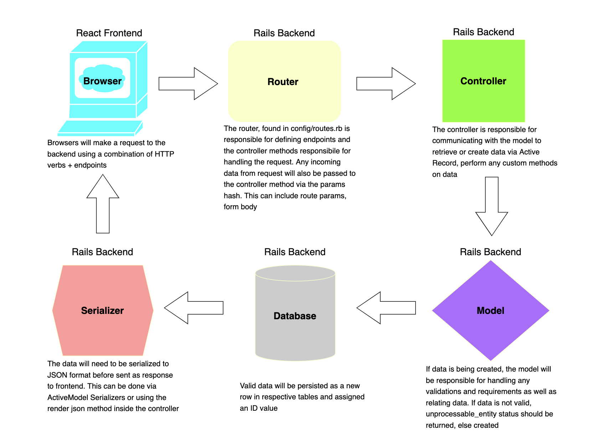

# Lecture 2: Client/Server Communication Pt 1

Before we get started, we need to make a minor change to the items table. The sold attribute should be defaulted to false, and currently it is not.

1. Create a migration:

```rb
rails g migration UpdateSoldInItems
```

2. Write the following migration:

```rb
class UpdateSoldInItems < ActiveRecord::Migration[6.1]
  def change
    change_column :items, :sold, :boolean, default: false
  end
end
```

3. Run `rails db:migrate` and then `rails db:seed:replant`

## Lecture Objectives

- Define a POST route
- Create a new resource
- Permit attributes via strong params
- Add model validations to avoid bad data
- Handle valid and invalid data response in controller
- Handle response on front end
- Test request/response flow via Postman

## Lecture Deliverables

1. [ ] [Add validations to models](#pt1)
2. [ ] [Configurations before moving forward](#pt2)
3. [ ] [Define an endpoint responsible for handling a request to create a new resource](#pt3)
4. [ ] [Handling request on back end in controller](#pt4)
5. [ ] [BONUS: Handling response on front end](#pt5)

### Frontend to Backend Request Response Flow

<p align="center">
    
</p>

### Thinking about validations

<div id='pt1'></div>

Validations are defined inside the model files.

[Active Record Validations](https://guides.rubyonrails.org/active_record_validations.html)

#### User

When a user account is created, must provide a unique username and email. Email must be in correct format:

```rb
class User < ApplicationRecord
  ...
    validates :username, presence: true, uniqueness: true
    validates :email, format: /\w+@\w+\.{1}[a-zA-Z]{2,}/, presence: true, uniqueness: true
end
```

#### Item

When an item is created, must provide a name and price. Price needs to be a dollar amount less than 10000. Upon creation, item will be associated with the currently logged in user:

```rb
class Item < ApplicationRecord
  ...

  validates :name, presence: true
  validates :price, presence: true, format: { with: /\A\d+(?:\.\d{0,2})?\z/, message: "Must be dollar amount" }, numericality: { greater_than: 0, less_than: 10000 }
end
```

#### Category

When a category is created, name should be present and unique:

```rb
class Category < ApplicationRecord
    ...

    validates :name, presence: true, uniqueness: true
end
```

### Client to Server Comm

[Rails Status codes](http://www.railsstatuscodes.com/)

Status codes we will use today:

```rb
:created # returns a 201 status code
:unprocessable_entity # returns a 422 status code
```

<div id='pt2'></div>

A few configurations before moving on:

```rb
inside config/initializers/wrap_parameters.rb

ActiveSupport.on_load(:action_controller) do
  wrap_parameters format: []
end
```

This will ensure that parameters do not get returned nested under the resource key.

```rb
inside ApplicationController

private

def current_user
  User.find_by_username("aisayo")
end
```

Eventually, current_user will return the currently logged in user. For now, we will hardcode the current user.

### Define an endpoint responsible for handling a request to create a new resource in `config/routes.rb`:

<div id='pt3'></div>

1. What HTTP verb is necessary?
2. What will the REST route look like?
3. What controller action will be responsible for handling request?

<details>
<summary></summary>
<li>post '/items', to: 'items#create'</li>

<strong>or</strong>

<li>resources :items, only: [:create]</li>
</details>

#### Create an action in ItemsController

```rb
def create
  byebug
end
```

#### Making a POST request on front end

```js
const configObj = {
  method: 'POST',
  headers: {
    'Content-Type': 'application/json'
  },
  body: JSON.stringify({...})
}
fetch(endpoint, configObj)
```

How to test:

1. Add byebug to create action
2. In postman create and send a post request
3. In byebug: first inspect `params`, then run `Item.new(params)`
4. Getting `*** ActiveModel::ForbiddenAttributesError Exception: ActiveModel::ForbiddenAttributesError` error due to Rails security provided on mass assignment
5. To resolve this, add strong params

#### Handling request on back end in controller:

<div id='pt4'></div>

1. Need to permit attributes via strong params if we want to use mass assignment:

Inside ItemsController, add:

```rb

private

  def item_params
    params.permit(:name, :price, :desc)
  end

```

2. Handle object creation in controller, making sure to add logic to address valid vs invalid data(three ways to do this). Respond with JSON:

```rb
def create
  item = current_user.sold_items.new(item_params)
  if item.save
    render json: item, status: :created
  else
    render json: { error: item.errors.full_messages }, status: :unprocessable_entity
  end
end
```

```rb
def create
  item = current_user.sold_items.create(item_params)
  if item.valid?
    render json: item, status: :created
  else
    render json: { errors: item.errors.full_messages }, status: :unprocessable_entity
  end
end
```

```rb
def create
  item = current_user.sold_items.create!(item_params)
  render json: item, status: :created
rescue ActiveRecord::RecordInvalid => invalid
  render json: { errors: invalid.record.errors.full_messages }, status: :unprocessable_entity
end
```

Repeat these steps for the remainder of the models.

### BONUS: Handling response on front end

<div id='pt5'></div>

```js
...
.then(resp => {
    if(resp.ok) {
      return resp.json()
    } else {
      return resp.json().then(errors => Promise.reject(errors))
    }
  })
  .then(groups => {
    console.log(groups) // happens if resp was ok
  })
  .catch(errors => {
    console.error(errors) // happens if resp was not ok
  })
```
